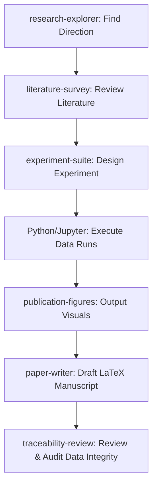

# AI-Scientist Playbook

[English](README.md) | [简体中文](README_zh.md) | [Français](README_fr.md) | [日本語](README_ja.md) | [한국어](README_ko.md) | [Español](README_es.md)

Welcome to the **AI-Scientist Playbook**! This is a curated, comprehensive guide detailing the leading open-source AI-scientist workbenches and local-first research platforms. It features resource directories, step-by-step installation guides, common FAQs, and advanced optimizations to help you supercharge your scientific research with AI.

---

## 🌟 The AI-Scientist Resource Matrix

| Project Name | Developer / Org | Website / Repository | Tech Stack | Status | Target Domain |
| :--- | :--- | :--- | :--- | :--- | :--- |
| **Open Science Desktop** | [ai4s-research](https://github.com/ai4s-research) | [openedscience.com](https://openedscience.com) / [open-science](https://github.com/ai4s-research/open-science) | Tauri, Rust, JS/TS | Beta (Active) | General Science / Cross-disciplinary |
| **OpenScience** | [synthetic-sciences](https://github.com/synthetic-sciences) | [openscience.sh](https://openscience.sh) / [openscience](https://github.com/synthetic-sciences/openscience) | Node.js, React, Browser | Active Release | Multi-disciplinary (ML, Bio, Chem, Phys) |
| **Open Science** | [aipoch](https://github.com/aipoch) | [aipoch.com](https://aipoch.com) / [open-science](https://github.com/aipoch/open-science) | Electron, React | Alpha (Early) | Medicine & Life Sciences |
| **Runcell Science** | [runcell-ai](https://github.com/runcell-ai) | [runcell-science](https://github.com/runcell-ai/runcell-science) | Local Workspace, React | Active | Multi-engine (Claude Code/Codex) |
| **AutoResearchClaw** | [aiming-lab](https://github.com/aiming-lab) | [AutoResearchClaw](https://github.com/aiming-lab/AutoResearchClaw) | Python, CLI | Active | Quantifiable Benchmark / Automation |
| **Dr. Claw** | [OpenLAIR](https://github.com/OpenLAIR) | [dr-claw](https://github.com/OpenLAIR/dr-claw) | Local IDE Agent | Active | Code-intensive Bio/Medical Research |
| **The AI Scientist** | [Sakana AI](https://sakana.ai) | [AI-Scientist](https://github.com/SakanaAI/AI-Scientist) / [v2](https://github.com/SakanaAI/AI-Scientist-v2) | Python, PyTorch | Academic | Machine Learning / AI Research |

---

## 🔍 Core Project Profiles

### 1. Open Science Desktop (ai4s-research)
A local-first, model-agnostic desktop client built on Tauri. It delivers a fast, native desktop environment for managing scientific agents and connecting external resources through standard Model Context Protocol (MCP) servers.

*   **Key Resources**:
    *   **GitHub**: [ai4s-research/open-science](https://github.com/ai4s-research/open-science)
    *   **Website**: [openedscience.com](https://openedscience.com)
    *   **Skills**: [ai4s-skills](https://github.com/ai4s-research/ai4s-skills)
*   **Strengths**: Native MCP support, lightweight Tauri app, complete pre-built skill packages covering the entire lifecycle.
*   **Limitations**: Relies heavily on importing external skill modules for specific domain tasks.

### 2. OpenScience (synthetic-sciences)
A web-based interactive workspace that bundles a local agent runtime with a browser-based user interface. This project was developed by a YC-backed team and targets rich out-of-the-box functionality.

*   **Key Resources**:
    *   **GitHub**: [synthetic-sciences/openscience](https://github.com/synthetic-sciences/openscience)
    *   **Website**: [openscience.sh](https://openscience.sh)
    *   **NPM Package**: [@synsci/openscience](https://www.npmjs.com/package/@synsci/openscience)
*   **Strengths**: 290+ built-in skills, 30+ pre-connected databases (UniProt, PDB, arXiv), and strong end-to-end automation across ML, biology, chemistry, and physics.
*   **Limitations**: No native compiled desktop app; operates entirely in browser tabs.

### 3. Open Science (aipoch)
An Electron-based specialized research client specifically designed for the biomedical and life sciences sectors.

*   **Key Resources**:
    *   **GitHub**: [aipoch/open-science](https://github.com/aipoch/open-science)
    *   **Website**: [aipoch.com](https://aipoch.com)
    *   **Skills**: [medical-research-skills](https://github.com/aipoch/medical-research-skills)
*   **Strengths**: Native PubMed, ClinVar, and GEO database integration; coordinator-subagent design tailored for bio-medical flows.
*   **Limitations**: Currently in early alpha; many features are placeholders or under active construction.

### 4. Runcell Science (runcell-ai)
A local-first pluggable AI scientific workspace. Its core feature is that it does not bind to a single agent engine, allowing users to hook in different engines like Claude Code, Codex, or OpenCode.

*   **Key Resources**:
    *   **GitHub**: [runcell-ai/runcell-science](https://github.com/runcell-ai/runcell-science)
*   **Strengths**: High UI parity with Claude Science; integrates chat, local files, DB connectors, generation artifacts, and code diff view; native MCP support.
*   **Limitations**: Workspace-heavy; requires manual configuration of the execution engine.

### 5. AutoResearchClaw (aiming-lab)
An automated scientific framework equipped with the authoritative *ResearchClawBench* evaluation suite. It is designed for standardized end-to-end automated task execution.

*   **Key Resources**:
    *   **GitHub**: [aiming-lab/AutoResearchClaw](https://github.com/aiming-lab/AutoResearchClaw)
*   **Strengths**: Quantifiable task completion score, customizable task templates, excellent for empirical replication studies.
*   **Limitations**: Weak interactive UI; runs mostly as a batch execution engine.

### 6. Dr. Claw (OpenLAIR)
An integrated research IDE and agent platform developed by Lehigh University. It focuses on literature retrieval, code execution, and data analysis in a unified IDE panel.

*   **Key Resources**:
    *   **GitHub**: [OpenLAIR/dr-claw](https://github.com/OpenLAIR/dr-claw)
*   **Strengths**: Supports engine switching, local-first data privacy, and a human-in-the-loop validation system to eliminate hallucinations. Great for bioinformatics code-heavy tasks.
*   **Limitations**: Lacks broader visual workspace layouts; acts more like an augmented scientific code editor.

---

## 🗺️ Landscape of Deployable Scientific Agents

Below is a directory of key scientific agent platforms, frameworks, and tools that can be deployed by researchers and laboratories:

| Agent / Toolkit Name | Developer | Release | Core Positioning | Deployment Method |
| :--- | :--- | :--- | :--- | :--- |
| **Claude Science** | Anthropic | 2026.6 | General Scientific AI Workspace | Local (macOS/Linux) + Cloud |
| **Omic (Omic AI)** | Omic AI | 2025 | Biological Superintelligence / Drug Discovery | SaaS + Private On-Premises |
| **Biomni** | Stanford (Chinese team) | 2026.7 | General Biomedical Agent | Claude Platform, Enterprise |
| **ScienceOS** | Independent | 2025.8 | Literature Review & Research Agent | SaaS (Cloud) |
| **The AI Scientist** | Sakana AI (Japan) | 2024.8 | Automated End-to-End Scientific Discovery | Open-source, Python (GitHub) |
| **Co-Scientist** | Google DeepMind | 2026.5 | Multi-agent Hypothesis Generation | Gemini for Science (By request) |
| **EvoScientist** | Independent | 2026.3 | Self-evolving Multi-agent Research Framework | Open-source (Apache 2.0), PyPI |
| **Agent Laboratory** | AMD + Johns Hopkins | 2025.1 | Full-workflow Autonomous Research | Open-source (Supports CPU/GPU) |
| **BioNeMo Agent Toolkit** | NVIDIA | 2026.6 | Life Sciences Agent Orchestration | NVIDIA NIM (Local or Cloud) |
| **LUMI-lab** | University of Toronto | 2025.2 | AI-driven Physical Lab (mRNA) | Physical Laboratory Integration |
| **Autoscience** | Autoscience | 2026.3 | Autonomous AI Research Laboratory | Managed Service for Enterprise |
| **OmicOS Science** | Local Team | 2026.7 | Genomics Analysis & AI Workbench | App Store (Local + Cloud) |
| **SciMaster** | DeepVerse + SJTU | 2025.7 | General Scientific Agent | Bohr Platform (SaaS + Private) |
| **MolClaw** | Shanghai AI Lab + PKU | 2026.5 | Drug Screening Agent | Collaborative Academic Deploy |
| **Yayi AI-Scientist** | Wenge + CAS | 2025.7 | Literature Research Assistant | SaaS Platform |
| **MoleculeOS (MOS)** | MoleculeMind | 2026.7 | AI Biopharma Research Operating System | Enterprise Platform |
| **MindSpore Science Agent**| Huawei | 2026.4 | Scientific Machine Learning Agent | Open-source, MindSpore |
| **ElementsClaw** | Alibaba DAMO + UCAS | 2026.7 | Superconducting Material Discovery | Open Database / Predictive Agent |
| **Pangshi Agent Factory** | CAS | 2025.11 | Research Agent Generation Platform | CAS Pangshi Platform |
| **"Dasheng" Sci-Agent** | SAIS + Fudan Univ | 2026.3 | System-level High-initiative Scientific Agent | Xinghe Qizhi Platform |
| **BioMedAgent** | Academic Group | 2026.4 | Biomedical Data Analysis Agent | Academic Paper Replication |
| **OmicsClaw** | Tsinghua AI4Life Lab | 2026.3 | Multi-omics AI Agent | Docker-based (OpenClaw) |

---

## 🧭 Key Principles & Workflow Methodology

To get the most out of an AI scientific workbench, developers and researchers should adhere to these core principles:

1.  **Not a Search Engine**: Do not treat the workbench as a general Q&A chat. It is designed to orchestrate complex local workflows, execute scripts, and compile datasets.
2.  **Break Down the Lifecycle**: Do not ask the agent to "write a paper" in a single step. Instead, execute step-by-step:
    $$\text{Topic Exploration} \rightarrow \text{Literature Survey} \rightarrow \text{Review Matrix} \rightarrow \text{Experiment Design} \rightarrow \text{Code Execution} \rightarrow \text{Figure Generation} \rightarrow \text{Paper Writing} \rightarrow \text{Integrity Audit}$$
3.  **Save Intermediate Artifacts**: Ensure the agent writes output files at every stage (e.g., `literature_matrix.csv`, `experiment_plan.md`, `results.json`, `figures/`, `paper.tex`, `audit_report.md`).
4.  **Full Traceability (Provenance)**: Design workflows so that every number, figure, and citation in the final paper can be traced back to a specific data log, codebase, or model run.
5.  **Draft Status Only**: Treat all outputs as drafts. The final responsibility for validating citations, checking math, and auditing code lies with the human researcher.

---

## 💬 Claude Science Style Prompts & Examples

### Example 1: Doing a Literature Review
*   ❌ **Bad Prompt**: "Write a literature review about AI in medical imaging."
*   ✔️ **Good Prompt**:
    ```text
    Please perform a systematic literature survey on the topic: "AI-assisted medical imaging for lung nodule screening".
    Requirements:
    1. Extract search query terms (English keywords, synonyms, MeSH terms).
    2. Retrieve literature from arXiv, PubMed, Semantic Scholar, and Crossref published in the last 5 years.
    3. Retain only papers with valid DOI, PMID, or arXiv IDs.
    4. Compile a survey matrix with columns: Paper Name, Year, Core Task, Datasets, Methodology, Performance Metrics, Findings, and Limitations.
    5. Summarize 3 research gaps and propose 3 potential paper directions.
    6. Place any unverified citations in a section labeled "Pending Verification".
    ```
*   *Recommended Skills*: `literature-survey`, `traceability-review`, `domain-check`.

### Example 2: CSV Data Analysis
*   ❌ **Bad Prompt**: "Analyze my experiment data CSV."
*   ✔️ **Good Prompt**:
    ```text
    Please analyze the dataset at workspace/data/experiment.csv.
    Tasks:
    1. Inspect fields, check for missing values, and identify outliers.
    2. Generate descriptive statistics.
    3. Perform appropriate statistical testing based on data distributions.
    4. Generate at least 3 publication-grade figures and save them to the figures/ directory.
    5. Save all detailed statistical summaries to results/statistics.md.
    6. Draft a "Results" section for a manuscript, clearly distinguishing between measured facts and interpretation.
    ```
*   *Recommended Skills*: `stats-integrity`, `publication-figures`, `experiment-suite`.

### Example 3: Reproducing a Paper's Experiments
*   ✔️ **Good Prompt**:
    ```text
    Please assist me in reproducing the core experiment of this paper.
    Inputs:
    - paper.pdf
    - Source code repository: [Refer to README]
    - Data schema/details: data/README.md
    Requirements:
    1. Parse the PDF to extract the main experimental objectives.
    2. Check if the provided codebase runs successfully.
    3. Create a dependency list (requirements.txt / environment.yml).
    4. Run a minimal reproducible example (MRE).
    5. Log all execution steps, errors, and fixes to runs/reproduction_log.md.
    6. Generate a final comparison table of the reproduced results vs. published figures.
    ```

### Example 4: Writing a Paper Draft
*   ✔️ **Good Prompt**:
    ```text
    Draft a manuscript draft based on the following local files:
    Materials:
    - literature_survey.md
    - results/statistics.md
    - figures/ (use existing image paths)
    - experiment_log.md
    Requirements:
    1. Use the standard structure: Abstract, Introduction, Related Work, Method, Experiment, Results, Discussion, Limitations, Conclusion.
    2. Citations must match entries in bibliography.bib.
    3. Generate LaTeX source code.
    4. Run traceability-review and stats-integrity tests on the generated output.
    ```
*   *Recommended Skills*: `paper-writer`, `publication-figures`, `traceability-review`, `stats-integrity`.

### Example 5: Auditing a Paper for Scientific Integrity
*   ✔️ **Good Prompt**:
    ```text
    Audit the scientific integrity of the manuscript at paper.pdf.
    Checklist:
    1. Verify that all citations are real and correctly resolve via DOI/PMID.
    2. Cross-reference numbers in text against results/statistics.md to ensure no data inflation.
    3. Flag any instances where simulated results are presented as measured laboratory results.
    4. Output the results in audit_report.md, categorized by severity (Major, Minor, Informational).
    ```
*   *Recommended Skills*: `integrity-auditor`.

---

## 🛠️ Extended Skills Library & MCP Extensions

### 1. General & Domain Skillsets
*   **K-Dense Scientific Agent Skills**: 138+ ready-to-use skills covering bioinformatics, computational chemistry, clinical research, geosciences, econometrics, and finance. Direct database integrations with ClinVar, ChEMBL, COSMIC, etc.
*   **scdenney/open-science-skills**: 23 social science skills covering text analysis, survey design, validation, and social science ethics checks.

### 2. Vertical Domain Skill Packages
*   **Bioinformatics (`Genomic Analysis`)**: Sequence alignment, differential gene expression, variant annotation, support for FASTQ/VCF files.
*   **Cheminformatics (`Cheminformatics Toolkit`)**: ADMET property prediction, virtual screening, molecular structure manipulation, chemical similarity using RDKit.
*   **Clinical/Medicine (`Clinical Research`)**: Trial search, evidence grading, variant pathogenicity analysis, integrating PubMed/ClinVar.
*   **Economics/Finance (`Economic Data Analysis`)**: Time series modeling, financial statement extraction, econometric calculations, integrating FRED and SEC EDGAR.
*   **Geospatial (`Geospatial Analysis`)**: Spatial analysis, remote sensing image processing, spatial interpolation using GeoPandas and GDAL.

### 3. General Workflow Optimizations
*   **Literature Sync**: Integrations to sync and pull literature collections directly from Zotero and Mendeley.
*   **Publication-Grade Plots**: Package utilizing plotly/matplotlib calibrated for journal dimensions and color schemes.
*   **Reproducible Pipelines**: One-click configuration to pack files and generate Conda/Docker settings.

### 4. Model Context Protocol (MCP) Connectors
*   **mcp.science**: Curated scientific MCP servers including Materials Project database access, PubMed Central full-text retrievals, and secure Python sandbox execution.
*   **Local Tool Connectors**: Jupyter notebooks MCP, Excel/CSV reader MCP, and local file system MCP.
*   **GitHub MCP**: Connects agents to GitHub repositories to search code, check diffs, and manage issues.

---

## 📂 Templates & Configuration Examples

To help you get started quickly, this repository provides pre-built templates and configuration files:

- **[Literature Matrix Template (CSV)](templates/literature_matrix_template.csv)**: A structured CSV template for organizing literature search parameters, findings, metrics, and DOIs.
- **[Experiment Plan Template (Markdown)](templates/experiment_plan_template.md)**: A standardized template for logging hypothesis definition, dataset descriptions, baseline models, run histories, and data validation checklists.
- **[Model Context Protocol (MCP) Configuration Example (JSON)](examples/mcp_config_example.json)**: A sample configuration file for setting up PubMed Central, Materials Project, SQLite, local filesystems, and GitHub MCP servers.

---

## ❓ FAQ & Troubleshooting

### Q1: Why does the workbench show "Python not found" on Windows?
This occurs when Python is either not installed or is not configured in your system `PATH`. On Windows, the default `python` command may point to a Windows Store shortcut. Make sure to download Python from the official site and check "Add Python to PATH" during installation. Verify the correct path points to:
`C:\Users\<username>\AppData\Local\Programs\Python\Python312\python.exe`

### Q2: Jupyter command is not found. How to fix?
If running `python -m jupyter --version` works but `jupyter --version` fails, your Python scripts folder is missing from the environment `PATH`. Add `C:\Users\<username>\AppData\Local\Programs\Python\Python312\Scripts\` to your user environment variables and restart the client.

### Q3: Why is my R installation not recognized?
The R executable folder (`Rscript.exe`) is likely missing from your `PATH`. Add the R bin path to your system variables:
`C:\Program Files\R\R-4.x.x\bin\x64`

### Q4: Windows displays a security warning during launch. Is it safe?
Yes. Because open-source desktops are locally compiled and may not be code-signed initially, Windows SmartScreen may trigger a warning. Click **More info** followed by **Run anyway**. You can audit the repository source code to verify there are no malicious components.

### Q5: Can these agents perform live web searches?
Yes, but they perform best when using structured MCP connectors rather than raw web searches. Standard MCP connectors (arXiv, PubMed, Semantic Scholar) ensure structured, clean data rather than raw HTML parsing.

### Q6: Can I install dozens of third-party skills?
You can, but exercise caution. Adding third-party skills gives the agent the ability to execute shell commands, read files, and call external endpoints. Review skill source code before loading untrusted packages.

### Q7: How do these tools differ from generic coding clients like Claude Desktop or Cursor?
Generic clients only support basic function calling without research context. Open science desktops feature integrated workspace panels, local data cache viewers, automatic database mapping, code diff check, and specialized coordinator-subagent architectures optimized specifically for the scientific lifecycle.

### Q8: Should I input commands one by one?
No. Provide a single structured prompt outlining the research question, data sources, and guidelines. The agent will execute the steps sequentially, saving output logs and figures directly to your directories.
*Example structured template*:
```text
Based on the current project directory, execute the standard research pipeline.
Research Topic: [Define topic, target variables, and ultimate goals]
Data Sources: [e.g., RNA-seq counts and clinical metrics in current folder]
Guidelines: [e.g., Output reproducible code, adhere to TRIPOD reporting standards]
```

### Q9: Are references and citations managed automatically?
Yes. The agent automatically creates a structured database (such as a `.bib` file) during the literature phase. During writing, it inserts standard citations in the text matching the bibliographic file and compiles a complete bibliography list at the end of the document.

---

## 🚀 Recommended Configuration & Workflows

For a robust research environment on macOS, Linux, or Windows, we recommend the following setup:

### 1. Tooling Prerequisites
- **Workbench**: [Open Science Desktop](https://github.com/ai4s-research/open-science)
- **Runtime**: Python (3.12+), Node.js (LTS), R Language
- **Libraries**: JupyterLab, Git, Rscript
- **LLM APIs**: Highly cost-effective flash models for routing (Gemini 2.5 Flash, GPT-4o mini, or Claude 3.5 Haiku) and frontier models for writing (Claude 3.5 Sonnet).

### 2. Standard Operation Pipeline


---

## 🤝 Contributing & License
We welcome contributions to this playbook! Feel free to open issues or submit pull requests with new resources, tips, or translations by following our **[Contributing Guidelines](CONTRIBUTING.md)**.

This project is open-sourced under the **[MIT License](LICENSE)**.
