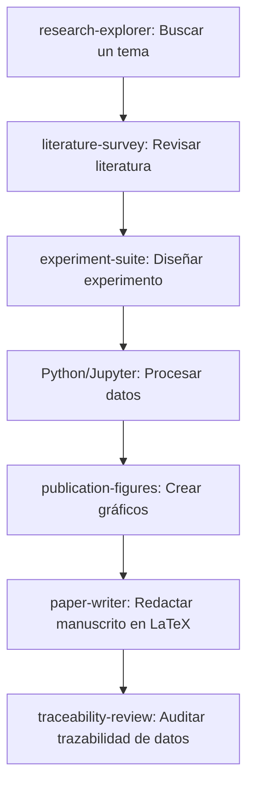

# Manual de AI-Scientist (AI-Scientist Playbook)

[English](README.md) | [简体中文](README_zh.md) | [Français](README_fr.md) | [日本語](README_ja.md) | [한국어](README_ko.md) | [Español](README_es.md)

¡Bienvenido al **Manual de AI-Scientist (AI-Scientist Playbook)**! Esta es una guía exhaustiva y seleccionada que detalla los principales entornos de trabajo de IA-Scientist de código abierto y las plataformas de investigación locales. Cuenta con directorios de recursos, guías de instalación paso a paso, preguntas frecuentes comunes (Q&A) y optimizaciones avanzadas para ayudarte a potenciar tu investigación científica mediante la inteligencia artificial.

---

## 🌟 Matriz de recursos de AI-Scientist

| Nombre del proyecto | Desarrollador / Org | Sitio web / Repositorio | Pila tecnológica | Estado | Campo objetivo |
| :--- | :--- | :--- | :--- | :--- | :--- |
| **Open Science Desktop** | [ai4s-research](https://github.com/ai4s-research) | [openedscience.com](https://openedscience.com) / [open-science](https://github.com/ai4s-research/open-science) | Tauri, Rust, JS/TS | Beta (Activo) | Ciencia general / Interdisciplinario |
| **OpenScience** | [synthetic-sciences](https://github.com/synthetic-sciences) | [openscience.sh](https://openscience.sh) / [openscience](https://github.com/synthetic-sciences/openscience) | Node.js, React, Navegador | Lanzamiento activo | Multidisciplinario (ML, Bio, Quim, Fis) |
| **Open Science** | [aipoch](https://github.com/aipoch) | [aipoch.com](https://aipoch.com) / [open-science](https://github.com/aipoch/open-science) | Electron, React | Alpha (Inicial) | Medicina y Ciencias de la vida |
| **Runcell Science** | [runcell-ai](https://github.com/runcell-ai) | [runcell-science](https://github.com/runcell-ai/runcell-science) | Espacio local, React | Activo | Multimotor (Claude Code/Codex) |
| **AutoResearchClaw** | [aiming-lab](https://github.com/aiming-lab) | [AutoResearchClaw](https://github.com/aiming-lab/AutoResearchClaw) | Python, CLI | Activo | Evaluación normada / Automatización |
| **Dr. Claw** | [OpenLAIR](https://github.com/OpenLAIR) | [dr-claw](https://github.com/OpenLAIR/dr-claw) | Agente IDE local | Activo | Bioinformática y Medicina |
| **The AI Scientist** | [Sakana AI](https://sakana.ai) | [AI-Scientist](https://github.com/SakanaAI/AI-Scientist) / [v2](https://github.com/SakanaAI/AI-Scientist-v2) | Python, PyTorch | Académico | Aprendizaje automático / IA |

---

## 🔍 Perfiles detallados de los proyectos

### 1. Open Science Desktop (ai4s-research)
Un cliente de escritorio basado en Tauri que prioriza el entorno local y es independiente del modelo. Ofrece un entorno nativo rápido para gestionar agentes científicos y conectar recursos externos mediante servidores estándar Model Context Protocol (MCP).

*   **Recursos clave**:
    *   **GitHub**: [ai4s-research/open-science](https://github.com/ai4s-research/open-science)
    *   **Sitio web**: [openedscience.com](https://openedscience.com)
    *   **Habilidades**: [ai4s-skills](https://github.com/ai4s-research/ai4s-skills)
*   **Fortalezas**: Soporte nativo de MCP, aplicación Tauri ligera, paquetes completos de habilidades preestablecidas de fábrica.
*   **Limitaciones**: Depende de la importación de habilidades externas para tareas muy específicas de dominio.

### 2. OpenScience (synthetic-sciences)
Un espacio de trabajo interactivo basado en navegador que combina una ejecución de agentes local con una interfaz web. Este proyecto fue desarrollado por un equipo respaldado por Y Combinator.

*   **Recursos clave**:
    *   **GitHub**: [synthetic-sciences/openscience](https://github.com/synthetic-sciences/openscience)
    *   **Sitio web**: [openscience.sh](https://openscience.sh)
    *   **Paquete NPM**: [@synsci/openscience](https://www.npmjs.com/package/@synsci/openscience)
*   **Fortalezas**: 290+ habilidades integradas, 30+ bases de datos conectadas (UniProt, PDB, arXiv), y alta automatización (ML, bio, química, física).
*   **Limitaciones**: No cuenta con aplicación de escritorio nativa independiente; funciona en pestañas del navegador.

### 3. Open Science (aipoch)
Un cliente de investigación especializado basado en Electron, diseñado específicamente para los sectores biomédico y de las ciencias de la vida.

*   **Recursos clave**:
    *   **GitHub**: [aipoch/open-science](https://github.com/aipoch/open-science)
    *   **Sitio web**: [aipoch.com](https://aipoch.com)
    *   **Habilidades**: [medical-research-skills](https://github.com/aipoch/medical-research-skills)
*   **Fortalezas**: Integración nativa de PubMed, ClinVar y GEO; arquitectura de coordinador y subagentes adaptada a flujos biomédicos.
*   **Limitaciones**: Actualmente en versión alpha temprana; muchas características están en desarrollo preliminar.

### 4. Runcell Science (runcell-ai)
Un espacio de trabajo de IA local y modular. Destaca por no vincular al usuario a un solo motor de agentes (permite usar Claude Code, Codex, etc.).

*   **Recursos clave**:
    *   **GitHub**: [runcell-ai/runcell-science](https://github.com/runcell-ai/runcell-science)
*   **Fortalezas**: Alta similitud con Claude Science; integra chat, archivos locales, bases de datos e historial de código; soporte MCP.
*   **Limitaciones**: Requiere configuración manual para enlazar el motor de ejecución.

### 5. AutoResearchClaw (aiming-lab)
Un marco de investigación automatizado integrado con el benchmark de evaluación *ResearchClawBench*.

*   **Recursos clave**:
    *   **GitHub**: [aiming-lab/AutoResearchClaw](https://github.com/aiming-lab/AutoResearchClaw)
*   **Fortalezas**: Puntuación cuantificable del avance de tareas, plantillas personalizadas para experimentos de réplica.
*   **Limitaciones**: Interfaz de usuario débil; funciona principalmente en línea de comandos.

### 6. Dr. Claw (OpenLAIR)
Un IDE de investigación integrado y plataforma de agentes desarrollada por el LAIR Lab de la Universidad de Lehigh.

*   **Recursos clave**:
    *   **GitHub**: [OpenLAIR/dr-claw](https://github.com/OpenLAIR/dr-claw)
*   **Fortalezas**: Cambio de motores, privacidad local de los datos y validación intermedia con humanos para evitar alucinaciones.
*   **Limitaciones**: Más cercano a un editor de código aumentado que a un entorno de trabajo completo.

---

## 🗺️ Mapa Ecológico de Agentes Científicos Desplegables

A continuación se listan las principales plataformas y marcos de agentes científicos que los investigadores pueden desplegar:

| Nombre del agente | Desarrollador | Lanzamiento | Posicionamiento principal | Método de despliegue |
| :--- | :--- | :--- | :--- | :--- |
| **Claude Science** | Anthropic | 2026.6 | Espacio de IA científica generalista | Local (macOS/Linux) + Nube |
| **Omic (Omic AI)** | Omic AI | 2025 | Superinteligencia biológica / Fármacos | SaaS + Privado local |
| **Biomni** | Stanford (team chino) | 2026.7 | Agente biomédico generalista | Claude Platform, Empresa |
| **ScienceOS** | Independiente | 2025.8 | Agente de revisión de literatura | SaaS (Nube) |
| **The AI Scientist** | Sakana AI (Japón) | 2024.8 | Descubrimiento científico automatizado | Código abierto, Python (GitHub) |
| **Co-Scientist** | Google DeepMind | 2026.5 | Generación de hipótesis multiagente | Gemini for Science (bajo petición) |
| **EvoScientist** | Independiente | 2026.3 | Marco de investigación autoevolutivo | Código abierto (Apache 2.0), PyPI |
| **Agent Laboratory** | AMD + Johns Hopkins | 2025.1 | Investigación autónoma de extremo a extremo| Código abierto (soporta CPU/GPU) |
| **BioNeMo Agent Toolkit** | NVIDIA | 2026.6 | Orquestación de agentes (ciencias vida) | NVIDIA NIM (Local o Nube) |
| **LUMI-lab** | Universidad de Toronto| 2025.2 | Laboratorio físico autónomo (ARNm) | Integración física del laboratorio |
| **Autoscience** | Autoscience | 2026.3 | Laboratorio autónomo de IA | Servicio administrado para empresas |
| **OmicOS Science** | Equipo local | 2026.7 | Análisis genómico y workbench | App Store (Local + Nube) |
| **SciMaster** | DeepVerse + Univ. SJTU | 2025.7 | Agente científico generalista | Plataforma Bohr (SaaS + Privado) |
| **MolClaw** | Shanghai AI Lab + PKU | 2026.5 | Agente de cribado de moléculas | Colaboración académica |
| **Yayi AI-Scientist** | Wenge + CAS | 2025.7 | Asistente de revisión de literatura | Plataforma SaaS |
| **MoleculeOS (MOS)** | MoleculeMind | 2026.7 | Sistema operativo de R&D bio | Plataforma Empresa |
| **MindSpore Science Agent**| Huawei | 2026.4 | Sistema de agentes científicos | Código abierto, base MindSpore |
| **ElementsClaw** | Alibaba DAMO + UCAS | 2026.7 | Descubrimiento de materiales superconductores| Base predictiva abierta / Agente |
| **Pangshi Agent Factory** | CAS | 2025.11 | Plataforma de generación de agentes | Plataforma Pangshi CAS |
| **Agente "Dasheng"** | SAIS + Univ. Fudan | 2026.3 | Agente con alta iniciativa de sistema | Plataforma Xinghe Qizhi |
| **BioMedAgent** | Grupo académico | 2026.4 | Análisis de datos biomédicos | Réplica académica |
| **OmicsClaw** | Tsinghua AI4Life Lab | 2026.3 | Agente de análisis multiómico | Docker (basado en OpenClaw) |

---

## 🧭 Principios Clave & Metodología de Uso

Para maximizar el rendimiento de estas herramientas, los investigadores deben seguir estos principios:

1.  **No es un motor de búsqueda**: Evita consultas informales (ej. "búscame esto"). El sistema está diseñado para ejecutar flujos locales, scripts y procesar datos.
2.  **Segmentación del ciclo de investigación**: No pidas escribir un artículo completo en un solo paso. Procede de la siguiente manera:
    $$\text{Exploración} \rightarrow \text{Estudio de literatura} \rightarrow \text{Matriz de revisión} \rightarrow \text{Diseño experimental} \rightarrow \text{Ejecución de código} \rightarrow \text{Gráficos} \rightarrow \text{Redacción} \rightarrow \text{Auditoría}$$
3.  **Guarda archivos intermedios**: Exige que el agente escriba entregables en cada etapa (`literature_matrix.csv`, `experiment_plan.md`, `results.json`, etc.).
4.  **Trazabilidad completa (Provenance)**: Cada número y gráfico final debe poder rastrearse hasta el código fuente o la sesión de ejecución.
5.  **Borrador preliminar**: Todos los archivos generados son borradores y deben ser revisados y validados manualmente por el investigador humano.

---

## 💬 Ejemplos de Prompts Estructurados (Estilo Claude Science)

### Ejemplo 1: Revisión de literatura
*   ❌ **Prompt inadecuado**: "Escribe una revisión de literatura sobre IA en imágenes médicas."
*   ✔️ **Prompt estructurado**:
    ```text
    Realice una revisión sistemática de literatura sobre el tema: "IA para la detección de nódulos pulmonares en imágenes médicas".
    Requisitos:
    1. Determine los términos de búsqueda (palabras clave en inglés, sinónimos, términos MeSH).
    2. Recupere artículos en arXiv, PubMed, Semantic Scholar y Crossref publicados en los últimos 5 años.
    3. Conserve únicamente artículos con DOI, PMID o arXiv ID válidos.
    4. Compile una matriz con las columnas: Título del artículo, Año, Tarea principal, Datos utilizados, Metodología, Métricas, Conclusiones y Limitaciones.
    5. Identifique 3 vacíos en las investigaciones actuales (research gaps) y sugiera 3 propuestas de artículos.
    6. Coloque las citas no verificadas en una sección etiquetada "A verificar".
    ```
*   *Habilidades recomendadas*: `literature-survey`, `traceability-review`, `domain-check`.

### Ejemplo 2: Análisis de datos estadísticos
*   ❌ **Prompt inadecuado**: "Analiza mi archivo CSV experimental."
*   ✔️ **Prompt estructurado**:
    ```text
    Analice el conjunto de datos en el archivo workspace/data/experiment.csv.
    Instrucciones:
    1. Inspeccione los campos, limpie valores faltantes e identifique anomalías.
    2. Genere estadísticas descriptivas básicas.
    3. Seleccione el método estadístico adecuado según las distribuciones de los datos.
    4. Genere al menos 3 gráficos listos para publicación y guárdelos en figures/.
    5. Guarde el reporte detallado en results/statistics.md.
    6. Redacte una sección "Resultados" para un manuscrito separando los hechos de la interpretación.
    ```
*   *Habilidades recomendadas*: `stats-integrity`, `publication-figures`, `experiment-suite`.

---

## 🛠️ Habilidades & Extensiones MCP

### 1. Habilidades Generales
*   **K-Dense Scientific Agent Skills**: Más de 138 habilidades listas para bioinformática, química computacional, clínica, econometría y finanzas. Conexión a ClinVar, ChEMBL, COSMIC, etc.
*   **scdenney/open-science-skills**: 23 habilidades para ciencias sociales (análisis de textos, validez de encuestas, ética).

### 2. Habilidades por Áreas
*   **Bioinformática (`Genomic Analysis`)**: Alineamiento de secuencias, expresión diferencial, anotación de variantes (FASTQ/VCF).
*   **Química Computacional (`Cheminformatics Toolkit`)**: Predicción ADMET, cribado virtual, similitud molecular con RDKit.
*   **Medicina Clínica (`Clinical Research`)**: Búsqueda de ensayos clínicos, nivel de evidencia, patogenicidad (PubMed/ClinVar).
*   **Economía y Finanzas (`Economic Data Analysis`)**: Series de tiempo, extracción de estados financieros, datos de FRED y SEC EDGAR.

### 3. Protocolos MCP (Model Context Protocol)
*   **mcp.science**: Servidores para Materials Project, PubMed Central (acceso a textos completos) y caja de arena Python segura.
*   **Herramientas locales**: Jupyter MCP, Excel/CSV reader MCP, sistema de archivos MCP.
*   **GitHub MCP**: Conecta los agentes a GitHub para leer código, diffs y gestionar issues.

---

## 📂 Plantillas y Ejemplos de Configuración

Para ayudarle a comenzar rápidamente, este repositorio proporciona plantillas y archivos de configuración listos para usar:

- **[Plantilla de matriz de literatura (CSV)](templates/literature_matrix_template.csv)**: Una plantilla CSV estructurada para organizar parámetros de búsqueda de literatura, hallazgos, métricas y DOI.
- **[Plantilla de plan de experimento (Markdown)](templates/experiment_plan_template.md)**: Una plantilla estandarizada para registrar definiciones de hipótesis, descripciones de conjuntos de datos, modelos de referencia, historiales de ejecución y listas de control de validación de datos.
- **[Ejemplo de configuración de MCP (Model Context Protocol) (JSON)](examples/mcp_config_example.json)**: Un archivo de configuración de muestra para configurar PubMed Central, Materials Project, SQLite, sistemas de archivos locales y servidores MCP de GitHub.

---

## ❓ Preguntas frecuentes y Solución de problemas

### Q1: ¿Por qué me aparece "Python not found" en Windows?
Verifica que Python esté agregado a las variables de entorno `PATH`. Al reinstalarlo, marca la opción "Add Python to PATH". El directorio de instalación debe ser similar a:
`C:\Users\<username>\AppData\Local\Programs\Python\Python312\python.exe`

### Q2: El comando Jupyter no se encuentra. ¿Cómo se corrige?
Si `python -m jupyter --version` corre pero `jupyter --version` falla, agrega el directorio de scripts al PATH del usuario:
`C:\Users\<username>\AppData\Local\Programs\Python\Python312\Scripts\`

### Q3: ¿Por qué mi R no es reconocido?
El binario `Rscript.exe` debe ser agregado manualmente al PATH:
`C:\Program Files\R\R-4.x.x\bin\x64`

### Q4: ¿Se manejan las citas de forma automática?
Sí. Durante el estudio bibliográfico se genera una base de datos (.bib). Al escribir, el agente coloca las referencias correspondientes y compila la lista bibliográfica final automáticamente.

---

## 🚀 Entornos & Flujos de Trabajo Recomendados

### 1. Requisitos
- **Cliente**: [Open Science Desktop](https://github.com/ai4s-research/open-science)
- **Runtime**: Python (3.12+), Node.js (LTS), R Language
- **Modelos de IA**: Modelos rápidos y económicos para el flujo inicial (**Gemini 2.5 Flash** para procesar literatura, **GPT-4o mini** y **Claude 3.5 Haiku** para coordinación de subagentes). Modelo avanzado (**Claude 3.5 Sonnet**) para la redacción final.

### 2. Flujo de Trabajo


---

## 🤝 Colaboración y Licencia
¡Agradecemos cualquier tipo de contribución a este manual! Siéntete libre de abrir problemas (issues) o enviar solicitudes de cambio (pull requests) para agregar recursos, consejos o traducciones adicionales siguiendo nuestras **[Directrices de Contribución (CONTRIBUTING.md)](CONTRIBUTING.md)**.

Este proyecto se distribuye bajo la licencia **[MIT (LICENSE)](LICENSE)**.
