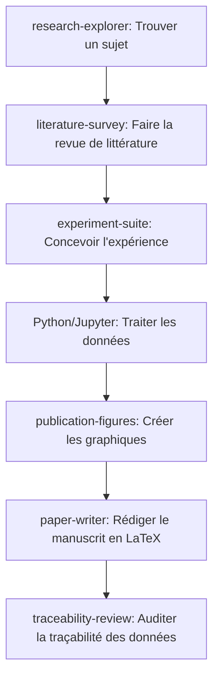

# Playbook AI-Scientist

[English](README.md) | [简体中文](README_zh.md) | [Français](README_fr.md) | [日本語](README_ja.md) | [한국어](README_ko.md) | [Español](README_es.md)

Bienvenue dans le **Playbook AI-Scientist** ! Il s'agit d'un guide complet et sélectionné détaillant les principaux environnements de travail d'IA-Scientist open-source et les plateformes de recherche locales. Il comprend des répertoires de ressources, des guides d'installation étape par étape, des FAQ courantes et des optimisations avancées pour vous aider à propulser votre recherche scientifique avec l'IA.

---

## 🌟 Matrice des ressources AI-Scientist

| Nom du projet | Développeur / Organisation | Site officiel / Dépôt | Pile technologique | Statut | Domaine cible |
| :--- | :--- | :--- | :--- | :--- | :--- |
| **Open Science Desktop** | [ai4s-research](https://github.com/ai4s-research) | [openedscience.com](https://openedscience.com) / [open-science](https://github.com/ai4s-research/open-science) | Tauri, Rust, JS/TS | Bêta (Actif) | Sciences générales / Transdisciplinaire |
| **OpenScience** | [synthetic-sciences](https://github.com/synthetic-sciences) | [openscience.sh](https://openscience.sh) / [openscience](https://github.com/synthetic-sciences/openscience) | Node.js, React, Navigateur | Version active | Multidisciplinaire (ML, Bio, Chim, Phys) |
| **Open Science** | [aipoch](https://github.com/aipoch) | [aipoch.com](https://aipoch.com) / [open-science](https://github.com/aipoch/open-science) | Electron, React | Alpha (Stade initial) | Médecine & Sciences de la vie |
| **Runcell Science** | [runcell-ai](https://github.com/runcell-ai) | [runcell-science](https://github.com/runcell-ai/runcell-science) | Espace local, React | Actif | Multi-moteurs (Claude Code/Codex) |
| **AutoResearchClaw** | [aiming-lab](https://github.com/aiming-lab) | [AutoResearchClaw](https://github.com/aiming-lab/AutoResearchClaw) | Python, CLI | Actif | Évaluation normée / Automatisation |
| **Dr. Claw** | [OpenLAIR](https://github.com/OpenLAIR) | [dr-claw](https://github.com/OpenLAIR/dr-claw) | Agent IDE local | Actif | Bio-informatique & Médical |
| **The AI Scientist** | [Sakana AI](https://sakana.ai) | [AI-Scientist](https://github.com/SakanaAI/AI-Scientist) / [v2](https://github.com/SakanaAI/AI-Scientist-v2) | Python, PyTorch | Académique | Apprentissage automatique / IA |

---

## 🔍 Profils détaillés des projets

### 1. Open Science Desktop (ai4s-research)
Un client de bureau axé sur le local et indépendant du modèle, basé sur Tauri. Il offre un environnement de bureau natif et rapide pour gérer les agents scientifiques et connecter des ressources externes via des serveurs MCP (Model Context Protocol).

*   **Ressources clés** :
    *   **GitHub** : [ai4s-research/open-science](https://github.com/ai4s-research/open-science)
    *   **Site web** : [openedscience.com](https://openedscience.com)
    *   **Compétences** : [ai4s-skills](https://github.com/ai4s-research/ai4s-skills)
*   **Forces** : Support MCP natif, application Tauri légère, paquets complets couvrant tout le cycle de vie de recherche.
*   **Limites** : Repose sur l'importation de modules de compétences externes pour les tâches spécifiques.

### 2. OpenScience (synthetic-sciences)
Un espace de travail interactif basé sur le web qui combine un runtime d'agent local avec une interface utilisateur de navigateur. Ce projet a été développé par une équipe soutenue par YC.

*   **Ressources clés** :
    *   **GitHub** : [synthetic-sciences/openscience](https://github.com/synthetic-sciences/openscience)
    *   **Site web** : [openscience.sh](https://openscience.sh)
    *   **Package NPM** : [@synsci/openscience](https://www.npmjs.com/package/@synsci/openscience)
*   **Forces** : Plus de 290 compétences intégrées, 30+ bases de données connectées, automatisation de bout en bout (ML, bio, chimie, physique).
*   **Limites** : Pas d'application de bureau native ; fonctionne dans les onglets du navigateur.

### 3. Open Science (aipoch)
Un client de recherche spécialisé basé sur Electron, conçu spécifiquement pour les secteurs de la biomédecine et des sciences de la vie.

*   **Ressources clés** :
    *   **GitHub** : [aipoch/open-science](https://github.com/aipoch/open-science)
    *   **Site web** : [aipoch.com](https://aipoch.com)
    *   **Compétences** : [medical-research-skills](https://github.com/aipoch/medical-research-skills)
*   **Forces** : Intégration de PubMed, ClinVar et GEO ; architecture coordinateur-sous-agent adaptée aux flux biomédicaux.
*   **Limites** : Phase alpha précoce ; de nombreuses fonctionnalités sont en cours de développement.

### 4. Runcell Science (runcell-ai)
Un espace de travail scientifique d'IA local et modulable. Il ne lie pas l'utilisateur à un seul moteur d'agent (ex: Claude Code, Codex).

*   **Ressources clés** :
    *   **GitHub** : [runcell-ai/runcell-science](https://github.com/runcell-ai/runcell-science)
*   **Forces** : Forte similitude avec Claude Science ; intègre chat, fichiers locaux, connecteurs de bases de données et historique de code ; support MCP.
*   **Limites** : Configuration manuelle requise pour lier le moteur d'exécution.

### 5. AutoResearchClaw (aiming-lab)
Un framework de recherche automatisé intégrant le benchmark d'évaluation *ResearchClawBench*.

*   **Ressources clés** :
    *   **GitHub** : [aiming-lab/AutoResearchClaw](https://github.com/aiming-lab/AutoResearchClaw)
*   **Forces** : Score quantifiable d'achèvement de tâche, modèles personnalisés pour les réplications.
*   **Limites** : Interface utilisateur faible ; fonctionne principalement en ligne de commande.

### 6. Dr. Claw (OpenLAIR)
Un IDE de recherche intégré et une plateforme d'agents développée par l'Université de Lehigh (LAIR Lab).

*   **Ressources clés** :
    *   **GitHub** : [OpenLAIR/dr-claw](https://github.com/OpenLAIR/dr-claw)
*   **Forces** : Changement de moteurs, confidentialité locale des données, validation avec humain dans la boucle pour éviter les hallucinations.
*   **Limites** : Plus proche d'un éditeur de code augmenté que d'un environnement de travail complet.

---

## 🗺️ Cartographie des Agents Scientifiques Déployables

Voici la liste des plateformes et frameworks d'agents de recherche déployables :

| Nom de l'agent | Développeur | Lancement | Positionnement principal | Mode de déploiement |
| :--- | :--- | :--- | :--- | :--- |
| **Claude Science** | Anthropic | 2026.6 | Espace scientifique d'IA généraliste | Local (macOS/Linux) + Cloud |
| **Omic (Omic AI)** | Omic AI | 2025 | Superintelligence biologique / Médicaments | SaaS + Privé sur site |
| **Biomni** | Stanford (team chinoise) | 2026.7 | Agent biomédical généraliste | Plateforme Claude, Entreprise |
| **ScienceOS** | Indépendant | 2025.8 | Agent d'étude de littérature | SaaS (Cloud) |
| **The AI Scientist** | Sakana AI (Japon) | 2024.8 | Découverte scientifique automatisée | Open-source, Python (GitHub) |
| **Co-Scientist** | Google DeepMind | 2026.5 | Génération d'hypothèses multi-agents | Gemini pour la science (sur demande) |
| **EvoScientist** | Indépendant | 2026.3 | Framework de recherche auto-évolutif | Open-source (Apache 2.0), PyPI |
| **Agent Laboratory** | AMD + Johns Hopkins | 2025.1 | Recherche autonome de bout en bout | Open-source (supporte CPU/GPU) |
| **BioNeMo Agent Toolkit** | NVIDIA | 2026.6 | Orchestration d'agents (sciences de la vie) | NVIDIA NIM (Local ou Cloud) |
| **LUMI-lab** | Université de Toronto | 2025.2 | Laboratoire physique autonome (ARNm) | Intégration physique labo |
| **Autoscience** | Autoscience | 2026.3 | Laboratoire de recherche autonome | Service managé pour entreprises |
| **OmicOS Science** | Équipe locale | 2026.7 | Analyse génomique et workbench | App Store (Local + Cloud) |
| **SciMaster** | DeepVerse + Univ. SJTU | 2025.7 | Agent scientifique généraliste | Plateforme Bohr (SaaS + Privé) |
| **MolClaw** | Shanghai AI Lab + PKU | 2026.5 | Agent de criblage de molécules | Partenariat universitaire |
| **Yayi AI-Scientist** | Wenge + CAS | 2025.7 | Assistant de recherche de littérature | Plateforme SaaS |
| **MoleculeOS (MOS)** | MoleculeMind | 2026.7 | Système d'exploitation R&D bio | Plateforme Entreprise |
| **MindSpore Science Agent**| Huawei | 2026.4 | Système d'agent d'IA scientifique | Open-source, MindSpore |
| **ElementsClaw** | Alibaba DAMO + UCAS | 2026.7 | Découverte de matériaux supraconducteurs| Base prédictive ouverte / Agent |
| **Pangshi Agent Factory** | CAS | 2025.11 | Plateforme de génération d'agents | Plateforme Pangshi CAS |
| **Agent "Dasheng"** | SAIS + Univ. Fudan | 2026.3 | Agent à forte initiative système | Plateforme Xinghe Qizhi |
| **BioMedAgent** | Groupe académique | 2026.4 | Analyse de données biomédicales | Réplication académique |
| **OmicsClaw** | Tsinghua AI4Life Lab | 2026.3 | Agent d'analyse multi-omique | Docker (basé sur OpenClaw) |

---

## 🧭 Principes clés & Méthodologie

Pour maximiser l'efficacité d'un environnement de travail d'IA scientifique, suivez ces principes :

1.  **Pas un simple moteur de recherche** : Ne traitez pas l'agent comme un simple chatbot. Il est conçu pour orchestrer des flux locaux complexes et traiter des données.
2.  **Découpage du cycle de recherche** : Ne demandez pas d'écrire un article en une seule fois. Suivez plutôt ce processus :
    $$\text{Exploration} \rightarrow \text{Étude de littérature} \rightarrow \text{Matrice de revue} \rightarrow \text{Conception de l'expérience} \rightarrow \text{Exécution du code} \rightarrow \text{Production de figures} \rightarrow \text{Rédaction} \rightarrow \text{Audit d'intégrité}$$
3.  **Sauvegarde des livrables intermédiaires** : L'agent doit écrire des fichiers à chaque étape (`literature_matrix.csv`, `experiment_plan.md`, `results.json`, etc.).
4.  **Traçabilité complète (Provenance)** : Chaque chiffre et figure finale doit pouvoir être retracé jusqu'au code source ou à la session d'agent correspondante.
5.  **Statut de brouillon uniquement** : Tous les fichiers générés doivent être considérés comme des brouillons et vérifiés manuellement par l'humain.

---

## 💬 Exemples de Prompts Structurés (Style Claude Science)

### Exemple 1 : Revue de littérature
*   ❌ **Mauvais prompt** : "Rédige une revue de littérature sur l'IA en imagerie médicale."
*   ✔️ **Bon prompt** :
    ```text
    Veuillez réaliser une revue de littérature systématique sur le thème : "L'IA pour le dépistage des nodules pulmonaires en imagerie médicale".
    Exigences :
    1. Déterminer les termes de recherche (mots-clés en anglais, synonymes, termes MeSH).
    2. Récupérer les articles sur arXiv, PubMed, Semantic Scholar et Crossref publiés ces 5 dernières années.
    3. Conserver uniquement les articles avec DOI, PMID ou arXiv ID valides.
    4. Compiler une matrice avec les colonnes : Titre de l'article, Année, Tâche principale, Données utilisées, Méthodologie, Métriques, Conclusions et Limites.
    5. Identifier 3 lacunes dans les recherches actuelles (research gaps) et suggérer 3 pistes d'articles.
    6. Mettre les citations non vérifiées dans une section "À vérifier".
    ```
*   *Compétences recommandées* : `literature-survey`, `traceability-review`, `domain-check`.

### Exemple 2 : Analyse de données CSV
*   ❌ **Mauvais prompt** : "Analyse le fichier CSV de mes expériences."
*   ✔️ **Bon prompt** :
    ```text
    Veuillez analyser le jeu de données dans le fichier workspace/data/experiment.csv.
    Tâches :
    1. Inspecter les champs, vérifier les valeurs manquantes et identifier les valeurs aberrantes.
    2. Générer des statistiques descriptives.
    3. Effectuer les tests statistiques appropriés selon les distributions.
    4. Générer au moins 3 figures prêtes pour publication et les enregistrer dans le dossier figures/.
    5. Enregistrer le rapport complet dans results/statistics.md.
    6. Rédiger une section "Résultats" pour un manuscrit en séparant les faits mesurés de l'interprétation.
    ```
*   *Compétences recommandées* : `stats-integrity`, `publication-figures`, `experiment-suite`.

### Exemple 3 : Réplication d'expériences de recherche
*   ✔️ **Bon prompt** :
    ```text
    Aidez-moi à répliquer l'expérience principale de cet article.
    Entrées :
    - paper.pdf (dans l'espace de travail)
    - Dépôt de code : [Référence dans le README]
    - Description des données : data/README.md
    Exigences :
    1. Lire l'article et extraire les objectifs expérimentaux.
    2. Vérifier si le code fourni fonctionne.
    3. Générer un fichier d'environnement (requirements.txt / environment.yml).
    4. Exécuter un exemple minimal reproductible (MRE).
    5. Enregistrer les commandes, les erreurs et les correctifs dans runs/reproduction_log.md.
    6. Produire un tableau comparant vos résultats aux chiffres publiés.
    ```

---

## 🛠️ Bibliothèque de Compétences & Extensions MCP

### 1. Compétences Générales & Social Sciences
*   **K-Dense Scientific Agent Skills** : Plus de 138 compétences couvrant la bio-informatique, la chimie computationnelle, la recherche clinique, l'économétrie et la finance. Intégrations avec ClinVar, ChEMBL, COSMIC, etc.
*   **scdenney/open-science-skills** : 23 compétences pour les sciences sociales (text mining, design de sondages, comités d'éthique).

### 2. Extensions Métiers
*   **Bio-informatique (`Genomic Analysis`)** : Alignement de séquences, expression différentielle, annotation de variants (FASTQ/VCF).
*   **Chimie computationnelle (`Cheminformatics Toolkit`)** : Prédiction ADMET, criblage virtuel, similarité moléculaire avec RDKit.
*   **Médecine Clinique (`Clinical Research`)** : Recherche d'essais, notation de preuves, pathogénicité de variants (PubMed/ClinVar).
*   **Économie et Finance (`Economic Data Analysis`)** : Analyse de séries temporelles, extraction de rapports financiers, intégration de FRED et SEC EDGAR.

### 3. Protocoles MCP (Model Context Protocol)
*   **mcp.science** : Serveurs MCP pour Materials Project, PubMed Central (accès texte intégral), et bac à sable Python sécurisé.
*   **Outils locaux** : Jupyter MCP, Excel/CSV reader MCP, système de fichiers MCP.
*   **GitHub MCP** : Connecte les agents à GitHub pour lire le code, faire des commits et gérer les issues.

---

## 📂 Modèles & Exemples de Configuration

Pour vous aider à démarrer rapidement, ce dépôt fournit des modèles et des fichiers de configuration prêts à l'emploi :

- **[Modèle de matrice de littérature (CSV)](templates/literature_matrix_template.csv)** : Un modèle CSV structuré pour organiser vos paramètres de recherche documentaire, résultats, métriques et DOI.
- **[Modèle de plan d'expérience (Markdown)](templates/experiment_plan_template.md)** : Un modèle standardisé pour enregistrer la définition de vos hypothèses, descriptions de jeux de données, modèles de base, historiques d'exécution et listes de contrôle de validation des données.
- **[Exemple de configuration MCP (Model Context Protocol) (JSON)](examples/mcp_config_example.json)** : Un exemple de fichier de configuration pour mettre en place les serveurs MCP pour PubMed Central, Materials Project, SQLite, les systèmes de fichiers locaux et GitHub.

---

## ❓ FAQ & Dépannage

### Q1 : Pourquoi mon environnement affiche-t-il "Python not found" sur Windows ?
Cela signifie que Python n'est pas configuré dans la variable `PATH` de votre système. Lors de l'installation de Python, assurez-vous de cocher "Add Python to PATH". Le chemin correct doit être similaire à :
`C:\Users\<username>\AppData\Local\Programs\Python\Python312\python.exe`

### Q2 : La commande Jupyter est introuvable. Comment corriger ?
Si `python -m jupyter --version` fonctionne mais pas `jupyter --version`, ajoutez le dossier des scripts Python au `PATH` utilisateur :
`C:\Users\<username>\AppData\Local\Programs\Python\Python312\Scripts\`

### Q3 : Pourquoi mon installation R n'est-elle pas reconnue ?
Le dossier contenant `Rscript.exe` doit être ajouté à la variable `PATH` :
`C:\Program Files\R\R-4.x.x\bin\x64`

### Q4 : Windows affiche un avertissement de sécurité lors du lancement. Est-ce sûr ?
Oui. N'étant pas commercialement signées par défaut, les applications open-source locales provoquent l'alerte Windows SmartScreen. Cliquez sur **Informations complémentaires** puis **Exécuter quand même**.

### Q5 : Les citations dans le texte sont-elles gérées automatiquement ?
Oui. Pendant l'étude de la littérature, l'agent crée une base de données de citations (fichier `.bib`). Lors de la rédaction, il insère les balises de citation correspondantes et génère automatiquement la bibliographie finale.

---

## 🚀 Configurations & Flux de Travail Recommandés

### 1. Prérequis environnementaux
- **Client** : [Open Science Desktop](https://github.com/ai4s-research/open-science)
- **Dépendances** : Python (3.12+), Node.js (LTS), R Language
- **Modèles d'IA** : Modèles Flash pour le routage (ex: **Gemini 2.5 Flash** ou **GPT-4o mini** et **Claude 3.5 Haiku**) pour réduire les coûts, et modèle de frontière (**Claude 3.5 Sonnet**) pour la rédaction.

### 2. Processus de Recherche


---

## 🤝 Contribution & Licence
Les contributions à ce playbook sont les bienvenues ! N'hésitez pas à ouvrir des tickets (issues) ou à soumettre des demandes d'intégration (pull requests) avec de nouvelles ressources, astuces ou traductions en suivant nos **[Directives de Contribution (CONTRIBUTING.md)](CONTRIBUTING.md)**.

Ce projet est sous licence **[MIT (LICENSE)](LICENSE)**.
