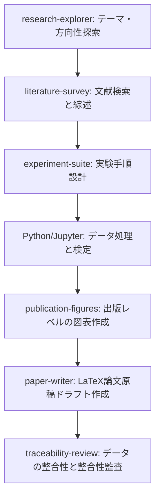

# AI-Scientist プレイブック

[English](README.md) | [简体中文](README_zh.md) | [Français](README_fr.md) | [日本語](README_ja.md) | [한국어](README_ko.md) | [Español](README_es.md)

**AI-Scientist プレイブック**へようこそ！本書は、主要なオープンソースのAIサイエンティスト・ワークベンチおよびローカルファーストの科学研究プラットフォームについてまとめた、総合的かつ厳選されたガイドです。AIを活用して科学研究を加速させるための、リソース一覧、ステップバイステップのインストールガイド、よくある質問（Q&A）、および高度な最適化テクニックを掲載しています。

---

## 🌟 AIサイエンティスト リソースマトリクス

| プロジェクト名 | 開発者 / 組織 | 公式サイト / リポジトリ | 主要技術スタック | 開発状況 | 対象領域 |
| :--- | :--- | :--- | :--- | :--- | :--- |
| **Open Science Desktop** | [ai4s-research](https://github.com/ai4s-research) | [openedscience.com](https://openedscience.com) / [open-science](https://github.com/ai4s-research/open-science) | Tauri, Rust, JS/TS | ベータ (活発) | 一般科学 / 異分野融合研究 |
| **OpenScience** | [synthetic-sciences](https://github.com/synthetic-sciences) | [openscience.sh](https://openscience.sh) / [openscience](https://github.com/synthetic-sciences/openscience) | Node.js, React, ブラウザ | リリース済 (活発) | 多分野 (ML, バイオ, 化学, 物理) |
| **Open Science** | [aipoch](https://github.com/aipoch) | [aipoch.com](https://aipoch.com) / [open-science](https://github.com/aipoch/open-science) | Electron, React | アルファ (初期段階) | 医学 & ライフサイエンス |
| **Runcell Science** | [runcell-ai](https://github.com/runcell-ai) | [runcell-science](https://github.com/runcell-ai/runcell-science) | ローカル環境, React | 活発 | マルチエンジン (Claude Code/Codex等) |
| **AutoResearchClaw** | [aiming-lab](https://github.com/aiming-lab) | [AutoResearchClaw](https://github.com/aiming-lab/AutoResearchClaw) | Python, CLI | 活発 | 標準化評価 / 自動実行 |
| **Dr. Claw** | [OpenLAIR](https://github.com/OpenLAIR) | [dr-claw](https://github.com/OpenLAIR/dr-claw) | ローカルIDEエージェント | 活発 | コード集中型バイオ / 医学研究 |
| **The AI Scientist** | [Sakana AI](https://sakana.ai) | [AI-Scientist](https://github.com/SakanaAI/AI-Scientist) / [v2](https://github.com/SakanaAI/AI-Scientist-v2) | Python, PyTorch | 学術研究 | 機械学習 / AI研究 |

---

## 🔍 主要プロジェクトの詳細

### 1. Open Science Desktop (ai4s-research)
Tauri上に構築された、ローカルファーストかつモデルアグノスティックなデスクトップクライアント。科学系エージェントを管理し、標準的なModel Context Protocol (MCP)サーバーを介して外部リソースに接続するための、高速でネイティブなデスクトップ環境を提供します。

*   **重要リソース**：
    *   **GitHub**：[ai4s-research/open-science](https://github.com/ai4s-research/open-science)
    *   **公式サイト**：[openedscience.com](https://openedscience.com)
    *   **スキルリポジトリ**：[ai4s-skills](https://github.com/ai4s-research/ai4s-skills)
*   **強み**：ネイティブなMCPサポート、軽量なTauriアプリ、ライフサイクル全体をカバーする豊富なビルトインスキル。
*   **制限事項**：特定ドメインのタスクには、外部スキルモジュールのインポートへの依存度が高い。

### 2. OpenScience (synthetic-sciences)
ローカルのエージェント・ランタイムとブラウザベースのUIを組み合わせた、Webベースのインタラクティブなワークスペース。YC支援チームによって開発され、初期状態で豊富な機能を提供します。

*   **重要リソース**：
    *   **GitHub**：[synthetic-sciences/openscience](https://github.com/synthetic-sciences/openscience)
    *   **公式サイト**：[openscience.sh](https://openscience.sh)
    *   **NPMパッケージ**：[@synsci/openscience](https://www.npmjs.com/package/@synsci/openscience)
*   **強み**：290以上の事前定義スキル、30以上の主要データベース（UniProt、PDB、arXivなど）へのネイティブコネクタ、高い自動実行能力。
*   **制限事項**：ネイティブなデスクトップアプリはなく、すべてブラウザのタブ内で動作。

### 3. Open Science (aipoch)
バイオ医学およびライフサイエンス分野向けに設計された、Electronベースの専門研究用クライアント。

*   **重要リソース**：
    *   **GitHub**：[aipoch/open-science](https://github.com/aipoch/open-science)
    *   **公式サイト**：[aipoch.com](https://aipoch.com)
    *   **医学スキル**：[medical-research-skills](https://github.com/aipoch/medical-research-skills)
*   **強み**：PubMed、ClinVar、GEOへのネイティブ接続。臨床・生信フローに適合したエージェント設計。
*   **制限事項**：初期アルファ段階にあり、多くの機能は開発中。

### 4. Runcell Science (runcell-ai)
ローカルファーストの可插抜な科学研究環境。単一のエージェントエンジンに束縛されず、Claude Code、Codexなどの多様な実行エンジンを任意に接続可能。

*   **重要リソース**：
    *   **GitHub**：[runcell-ai/runcell-science](https://github.com/runcell-ai/runcell-science)
*   **強み**：Claude Scienceと高いUI整合性；チャット、ローカルファイル、DB接続、コードの差分管理を統合。
*   **制限事項**：環境設定が複雑で、エンジンの手動設定が必要。

### 5. AutoResearchClaw (aiming-lab)
標準化された科研タスクの自律実行のために開発された自動化フレームワーク。*ResearchClawBench*という評価基準と連動。

*   **重要リソース**：
    *   **GitHub**：[aiming-lab/AutoResearchClaw](https://github.com/aiming-lab/AutoResearchClaw)
*   **強み**：評価基準に基づくスコア化、再現実験用のテンプレート機能。
*   **制限事項**：UI機能が弱く、主にコマンドラインでのバッチ処理に向く。

### 6. Dr. Claw (OpenLAIR)
理海大学（Lehigh University）のLAIRラボが開発した、文献調査・コード実行・データ分析を同一のIDE画面に統合したエージェントプラットフォーム。

*   **重要リソース**：
    *   **GitHub**：[OpenLAIR/dr-claw](https://github.com/OpenLAIR/dr-claw)
*   **強み**：複数エンジンの切り替え対応、ローカルデータプライバシー、ハルシネーションを防ぐ人間介入機能。
*   **制限事項**：エディタ寄りであり、総合ワークスペースとしての強みは限定的。

---

## 🗺️ 科研エージェントのエコシステム全景マップ

以下は、研究者や研究室がデプロイ可能な主要な科学研究エージェントおよびプラットフォームの一覧です：

| エージェント / ツール名称 | 開発元 | リリース | コア位置づけ | デプロイ方式 |
| :--- | :--- | :--- | :--- | :--- |
| **Claude Science** | Anthropic | 2026.6 | 汎用科学研究AIワークスペース | ローカル (macOS/Linux) + クラウド |
| **Omic (Omic AI)** | Omic AI | 2025 | バイオ超知能 / 創薬 | SaaS + オンプレミス私有化 |
| **Biomni** | スタンフォード大 (華人チーム) | 2026.7 | 汎用バイオ医学エージェント | Claude Platform, エンタープライズ |
| **ScienceOS** | 個人開発者 | 2025.8 | 文献調査エージェント | SaaS クラウド |
| **The AI Scientist** | Sakana AI (日本) | 2024.8 | 全自動エンドツーエンド科学発見 | オープンソース, Python (GitHub) |
| **Co-Scientist** | Google DeepMind | 2026.5 | 複数エージェントによる仮説生成 | Gemini for Science (要申請) |
| **EvoScientist** | 個人開発者 | 2026.3 | 自己進化マルチエージェント科学 | オープンソース (Apache 2.0), PyPI |
| **Agent Laboratory** | AMD + ジョンズホプキンス | 2025.1 | 自律的科学研究フレームワーク | オープンソース (CPU/GPU対応) |
| **BioNeMo Agent Toolkit** | NVIDIA | 2026.6 | ライフサイエンスエージェントツール | NVIDIA NIM (クラウドまたはローカル) |
| **LUMI-lab** | トロント大学 | 2025.2 | AI自律物理実験室 (mRNA) | 物理ラボのハードウェア統合 |
| **Autoscience** | Autoscience | 2026.3 | 自律AI研究ラボ | 企業向けマネージドサービス |
| **OmicOS Science** | 国内チーム | 2026.7 | ゲノム分析 / AIワークベンチ | App Store (ローカル + クラウド) |
| **SciMaster** | 深勢科技 + 上海交大 | 2025.7 | 汎用科学研究エージェント | Bohr Platform (SaaS + 私有デプロイ) |
| **MolClaw** | 上海AIラボ + 北京大 | 2026.5 | 創薬スクリーニングエージェント | 大学連携デプロイ |
| **Yayi AI-Scientist** | 中科聞歌 + 中科院 | 2025.7 | 文献調査アシスタント | SaaSプラットフォーム |
| **MoleculeOS (MOS)** | 分子之心 | 2026.7 | AIバイオ研究開発OS | エンタープライズプラットフォーム |
| **MindSpore Science Agent**| ファーウェイ | 2026.4 | 科学研究エージェントシステム | オープンソース, MindSpore基盤 |
| **ElementsClaw** | アリババ達摩院 + 国科大 | 2026.7 | 超伝導材料発見エージェント | オープンデータベース / 予測 |
| **Pangshi Agent Factory** | 中科院 | 2025.11 | 研究エージェント生成プラットフォーム| 中科院Pangshiプラットフォーム |
| **「大聖」科学エージェント** | SAIS + 復旦大学 | 2026.3 | 自律的システム級科学エージェント | 星河啓智プラットフォーム |
| **BioMedAgent** | アカデミックチーム | 2026.4 | バイオ医学データ分析エージェント | 学術成果、再現可能 |
| **OmicsClaw** | 清華大 AI4Life Lab | 2026.3 | マルチオミクスAIエージェント | Dockerデプロイ (OpenClawベース) |

---

## 🧭 科研エージェント利用の重要原則

科学研究ワークベンチで最高の成果を得るには、以下の原則を厳守してください：

1.  **検索エンジンとして扱わない**：単なる一問一答の検索（例: 「〇〇について調べて」）ではなく、複雑なローカルワークフローの実行やスクリプト処理、データの整理に利用してください。
2.  **科研サイクルを分解する**：エージェントに一度で「論文を書き上げて」と要求してはいけません。以下の順で段階的に進めてください：
    $$\text{テーマ探索} \rightarrow \text{文献調査} \rightarrow \text{レビュー行列作成} \rightarrow \text{実験設計} \rightarrow \text{コード実行} \rightarrow \text{図表生成} \rightarrow \text{執筆} \rightarrow \text{監査}$$
3.  **中間生成物を保存する**：各フェーズで、再現可能なファイル（例: `literature_matrix.csv`, `experiment_plan.md`, `results.json` など）を出力させてください。
4.  **完全な追跡可能性 (Provenance)**：論文内の数値、グラフ、引用は、すべて元の実験コード、データセット、または対話ログに追跡可能に構成してください。
5.  **ドラフトの位置づけ**：エージェントの出力はすべてドラフトです。引用や数値の最終確認、コードの実行確認は、必ず人間の研究者自身が責任を持って行ってください。

---

## 💬 構造化プロンプトの事例 (Claude Science スタイル)

### 例1：文献レビュー
*   ❌ **不適切なプロンプト**：「AI医療画像診断のレビュー論文を書いて。」
*   ✔️ **構造化されたプロンプト**：
    ```text
    「AI支援による肺結節スクリーニング画像診断」をテーマに、体系的な文献調査を実行してください。
    要件：
    1. 検索用キーワード（英語キーワード、類義語、MeSH用語）を抽出すること。
    2. arXiv、PubMed、Semantic Scholar、Crossrefから過去5年間に公開された論文を検索すること。
    3. 有効なDOI、PMID、またはarXiv IDを持つ実在する論文のみを対象とすること。
    4. 調査マトリクスを作成し、以下の項目を整理すること：論文タイトル、公開年、主要タスク、データセット、方法、主要評価指標、主要な結論、制限事項。
    5. 現在の研究課題（Research Gaps）を3つ特定し、推奨する論文執筆テーマを3つ提案すること。
    6. 架空の文献を絶対に生成しないこと。確認できないものは「要確認」セクションに分類すること。
    ```
*   *推奨スキル*：`literature-survey`, `traceability-review`, `domain-check`。

### 例2：CSVデータの統計解析
*   ❌ **不適切なプロンプト**：「実験データのCSVを解析して。」
*   ✔️ **構造化されたプロンプト**：
    ```text
    ワークスペース内の workspace/data/experiment.csv を解析してください。
    タスク：
    1. 各項目の意味を確認し、欠損値や外れ値の処理を行うこと。
    2. 基本的な記述統計量を算出すること。
    3. データの分布タイプに応じて、適切な統計学的検定方法（有意差分析）を選択し実行すること。
    4. 論文掲載用の図表を少なくとも3枚作成し、figures/ ディレクトリに保存すること。
    5. 詳細な統計結果を results/statistics.md に保存すること。
    6. 学術論文用の "Results" セクションの原稿をドラフトすること（「測定事実」と「考察・推論」を明確に書き分けること）。
    ```
*   *推奨スキル*：`stats-integrity`, `publication-figures`, `experiment-suite`。

---

## 🛠️ スキルパッケージ & MCP連携

### 1. 汎用・クロスドメインスキル
*   **K-Dense Scientific Agent Skills**：バイオ情報学、計算化学、臨床研究、地学、計量経済学、金融など138以上のスキル。ClinVar、ChEMBL、COSMIC等のDBに直接接続。
*   **scdenney/open-science-skills**：社会科学系スキル（テキスト分析、アンケートの信頼性評価、倫理審査など）。

### 2. 専門ドメインスキル
*   **バイオ情報学 (`Genomic Analysis`)**：配列アライメント、差異発現解析、変異アノテーション（FASTQ/VCF対応）、NCBI/Ensembl連携。
*   **計算化学・創薬 (`Cheminformatics Toolkit`)**：RDKitによる分子構造処理、相似度計算、ADMET予測、仮想スクリーニング。
*   **臨床医学 (`Clinical Research`)**：治験情報の検索、証拠レベル評価、変異致病性解析（PubMed/ClinVar連携）。
*   **経済・金融 (`Economic Data Analysis`)**：時系列モデル作成、財務データ抽出、FRED / SEC EDGAR 連携。

### 3. MCP (Model Context Protocol) 連携
*   **mcp.science**：Materials Project データベース、PubMed Central 全文検索、安全な Python サンドボックスなど専用 MCP サーバー。
*   **ローカルツール連携**：Jupyter MCP、Excel/CSV reader MCP、ファイルシステム MCP。
*   **GitHub MCP**：コード検索、差分確認、Issue管理用。

---

## 📂 テンプレートと構成例

すぐに使い始められるよう、本リポジトリには事前に構築されたテンプレートと設定ファイルが用意されています：

- **[文献レビュー行列テンプレート (CSV)](templates/literature_matrix_template.csv)**：文献の検索条件、結果、指標、DOIなどを整理するための構造化されたCSVテンプレート。
- **[実験計画書テンプレート (Markdown)](templates/experiment_plan_template.md)**：仮説の定義、データセットの説明、基準モデル、実行履歴、データ監査用チェックリストを記録するための標準化されたテンプレート。
- **[MCP (Model Context Protocol) 構成例 (JSON)](examples/mcp_config_example.json)**：PubMed Central、Materials Project、SQLite、ローカルファイルシステム、GitHub MCPサーバーを設定するためのサンプルファイル。

---

## ❓ よくある質問とトラブルシューティング

### Q1: Windows上で「Python not found」と表示されます。
Pythonがインストールされていないか、`PATH`が正しく設定されていません。Pythonのインストール時に必ず "Add Python to PATH" を有効にしてください。正しい絶対パスは以下のようになります：
`C:\Users\<ユーザ名>\AppData\Local\Programs\Python\Python312\python.exe`

### Q2: Jupyterコマンドが見つかりません。
`python -m jupyter --version` は通るのに `jupyter --version` でエラーが出る場合は、ScriptsディレクトリをPATHに追加する必要があります：
`C:\Users\<ユーザ名>\AppData\Local\Programs\Python\Python312\Scripts\`

### Q3: インストールしたRが認識されません。
`Rscript.exe` のあるパスをシステム環境変数 PATH に追加してください。デフォルトのパス：
`C:\Program Files\R\R-4.x.x\bin\x64`

### Q4: 参考文献の正文への挿入は自動で行われますか？
はい。文献調査フェーズで自動生成される標準的なBibTeXファイル（`.bib`）に基づいて、論文の執筆時に正文内の適切な箇所に引用タグ（例: `\cite{...}`）が自動で挿入され、末尾に文献リストが自動生成されます。

---

## 🚀 推奨される環境構成 & 科学研究ワークフロー

### 1. ソフトウェア構成
- **クライアント**：[Open Science Desktop](https://github.com/ai4s-research/open-science)
- **基礎依存**：Python (3.12+), Node.js (LTS), R言語
- **大模型 API**：調査やルーティング用として、価格が安く高速な **Gemini 2.5 Flash**（超長文の読み込みに最適）や **GPT-4o mini** と **Claude 3.5 Haiku** を推奨。執筆段階のみ **Claude 3.5 Sonnet** に切り替えます。

### 2. 標準的な科研プロセス


---

## 🤝 貢献 & ライセンス
本プレイブックへの貢献を歓迎します！新しいリソース、ヒント、または翻訳の追加について、Issueの起票やPull Requestの送信をいつでもお待ちしております。詳細は **[貢献ガイドライン (CONTRIBUTING.md)](CONTRIBUTING.md)** をご覧ください。

本プロジェクトは **[MIT ライセンス (LICENSE)](LICENSE)** に基づいてオープンソースとして提供されています。
