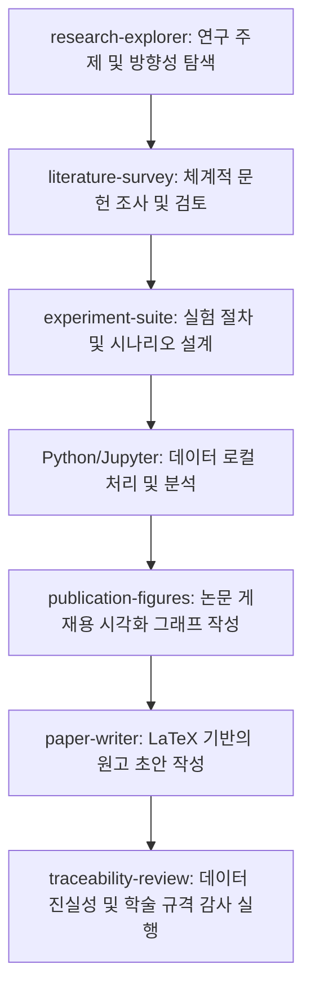

# 오픈 사이언스 & AI 사이언티스트 플레이북 (Open Science & AI-Scientist Playbook)

[English](README.md) | [简体中文](README_zh.md) | [Français](README_fr.md) | [日本語](README_ja.md) | [한국어](README_ko.md) | [Español](README_es.md)

**오픈 사이언스 & AI 사이언티스트 플레이북**에 오신 것을 환영합니다! 이 가이드는 주요 오픈소스 AI 과학 연구 워크벤치와 로컬 우선(local-first) 연구 플랫폼을 상세히 다루는 종합적이고 엄선된 안내서입니다. AI를 활용하여 과학 연구의 효율성을 극대화할 수 있도록 리소스 모음, 단계별 설치 안내, 자주 묻는 질문(Q&A), 그리고 고급 최적화 팁을 제공합니다.

---

## 🌟 AI-Scientist 리소스 매트릭스

| 프로젝트명 | 개발자 / 조직 | 공식 웹사이트 / 저장소 | 주요 기술 스택 | 개발 상태 | 대상 분야 |
| :--- | :--- | :--- | :--- | :--- | :--- |
| **Open Science Desktop** | [ai4s-research](https://github.com/ai4s-research) | [openedscience.com](https://openedscience.com) / [open-science](https://github.com/ai4s-research/open-science) | Tauri, Rust, JS/TS | 베타 (활성) | 일반 과학 / 학제간 연구 |
| **OpenScience** | [synthetic-sciences](https://github.com/synthetic-sciences) | [openscience.sh](https://openscience.sh) / [openscience](https://github.com/synthetic-sciences/openscience) | Node.js, React, 브라우저 | 정식 릴리즈 (활성) | 다학제 (ML, 바이오, 화학, 물리) |
| **Open Science** | [aipoch](https://github.com/aipoch) | [aipoch.com](https://aipoch.com) / [open-science](https://github.com/aipoch/open-science) | Electron, React | 알파 (초기 단계) | 의학 및 생명 과학 |
| **Runcell Science** | [runcell-ai](https://github.com/runcell-ai) | [runcell-science](https://github.com/runcell-ai/runcell-science) | 로컬 워크스페이스, React | 활성 | 멀티 엔진 (Claude Code/Codex 등) |
| **AutoResearchClaw** | [aiming-lab](https://github.com/aiming-lab) | [AutoResearchClaw](https://github.com/aiming-lab/AutoResearchClaw) | Python, CLI | 활성 | 정량적 벤치마크 / 자동 실행 |
| **Dr. Claw** | [OpenLAIR](https://github.com/OpenLAIR) | [dr-claw](https://github.com/OpenLAIR/dr-claw) | 로컬 IDE 에이전트 | 활성 | 코드 집중형 바이오/의학 연구 |
| **The AI Scientist** | [Sakana AI](https://sakana.ai) | [AI-Scientist](https://github.com/SakanaAI/AI-Scientist) / [v2](https://github.com/SakanaAI/AI-Scientist-v2) | Python, PyTorch | 학술 연구 | 머신러닝 / AI 연구 |

---

## 🔍 주요 프로젝트 상세 프로필

### 1. Open Science Desktop (ai4s-research)
Tauri 프레임워크를 기반으로 구축된 로컬 우선, 모델 독립적 데스크톱 클라이언트입니다. 과학 연구용 에이전트를 효율적으로 관리하고 표준 Model Context Protocol (MCP) 서버를 통해 외부 자원과 연결할 수 있는 데스크톱 환경을 제공합니다.

*   **주요 리소스**:
    *   **GitHub**: [ai4s-research/open-science](https://github.com/ai4s-research/open-science)
    *   **공식 웹사이트**: [openedscience.com](https://openedscience.com)
    *   **스킬셋**: [ai4s-skills](https://github.com/ai4s-research/ai4s-skills)
*   **강점**: 네이티브 MCP 지원, 경량 Tauri 앱, 연구 전주기를 커버하는 강력한 빌트인 스킬셋.
*   **한계**: 특정 도메인의 세부적인 작업을 위해 외부 스킬 모듈 임포트에 크게 의존합니다.

### 2. OpenScience (synthetic-sciences)
로컬 에이전트 런타임과 브라우저 기반 사용자 인터페이스를 결합한 웹 기반의 인터랙티브 워크스페이스입니다. Y Combinator의 투자를 받은 팀이 개발했습니다.

*   **주요 리소스**:
    *   **GitHub**: [synthetic-sciences/openscience](https://github.com/synthetic-sciences/openscience)
    *   **공식 웹사이트**: [openscience.sh](https://openscience.sh)
    *   **NPM 패키지**: [@synsci/openscience](https://www.npmjs.com/package/@synsci/openscience)
*   **강점**: 290개 이상의 사전 정의된 스킬, 30개 이상의 공인 데이터베이스(UniProt, PDB, arXiv 등) 연동 지원.
*   **한계**: 데스크톱 설치형 앱이 없으며 웹 브라우저에서만 구동됩니다.

### 3. Open Science (aipoch)
생물의학 및 생명 과학 분야 연구자를 위해 특별히 설계된 Electron 기반의 전문 연구용 클라이언트입니다.

*   **주요 리소스**:
    *   **GitHub**: [aipoch/open-science](https://github.com/aipoch/open-science)
    *   **공식 웹사이트**: [aipoch.com](https://aipoch.com)
    *   **스킬셋**: [medical-research-skills](https://github.com/aipoch/medical-research-skills)
*   **강점**: PubMed, ClinVar, GEO 연동 내장. 의생명 워크플로우에 맞춤 설계된 에이전트 레이아웃.
*   **한계**: 초기 알파 단계로 많은 기능이 현재 개발 중에 있습니다.

### 4. Runcell Science (runcell-ai)
로컬 우선 가변형 AI 과학 연구 공간입니다. 특정 에이전트에 종속되지 않고 Claude Code, Codex 등 다양한 코드 에이전트를 연결하여 사용할 수 있습니다.

*   **주요 리소스**:
    *   **GitHub**: [runcell-ai/runcell-science](https://github.com/runcell-ai/runcell-science)
*   **강점**: Claude Science와 높은 UI 부합성. 대화, 로컬 파일, DB 연동, 코드 Diff 뷰를 단일 작업 환경에 통합.
*   **한계**: 초기 구성 및 에이전트 엔진 수동 연결 과정이 필요합니다.

### 5. AutoResearchClaw (aiming-lab)
*ResearchClawBench* 연구 역량 평가 벤치마크와 연동되는 자동화 프레임워크입니다.

*   **주요 리소스**:
    *   **GitHub**: [aiming-lab/AutoResearchClaw](https://github.com/aiming-lab/AutoResearchClaw)
*   **강점**: 정량화된 작업 완료도 점수 제공, 실험 복제를 위한 맞춤형 템플릿 지원.
*   **한계**: 대화형 UI가 약하며 명령어 실행 중심입니다.

### 6. Dr. Claw (OpenLAIR)
리하이 대학(Lehigh University) LAIR 랩이 개발한 논문 조사, 코드 실행, 데이터 분석 통합 IDE 에이전트 플랫폼입니다.

*   **주요 리소스**:
    *   **GitHub**: [OpenLAIR/dr-claw](https://github.com/OpenLAIR/dr-claw)
*   **강점**: 복수 엔진 전환 기능 지원, 완전한 로컬 데이터 프라이버시 보장, 환각 현상을 억제하기 위한 사람 검증 시스템 내장.
*   **한계**: 코드 편집기 성향이 강해 종합적인 작업 공간 기능은 다소 부족합니다.

---

## 🗺️ 배포 가능한 과학 연구 에이전트 생태계 전체 맵

연구자나 실험실에서 배포해 사용할 수 있는 주요 에이전트 플랫폼 및 프레임워크 목록입니다:

| 에이전트 / 툴 이름 | 개발처 | 출시년도 | 핵심 포지셔닝 | 배포 방식 |
| :--- | :--- | :--- | :--- | :--- |
| **Claude Science** | Anthropic | 2026.6 | 범용 과학 연구용 AI 워크스페이스 | 로컬 (macOS/Linux) + 클라우드 |
| **Omic (Omic AI)** | Omic AI | 2025 | 생물학적 초지능 / 신약 개발 | SaaS + 온프레미스 사내 구축 |
| **Biomni** | 스탠퍼드 대 (중국계 팀) | 2026.7 | 범용 생물의학 에이전트 | Claude Platform 기반, 기업용 |
| **ScienceOS** | 개인 개발자 | 2025.8 | 논문 문헌 조사 에이전트 | SaaS 클라우드 |
| **The AI Scientist** | Sakana AI (일본) | 2024.8 | 전과정 자동화 종단간 과학 발견 | 오픈소스, Python (GitHub) |
| **Co-Scientist** | Google DeepMind | 2026.5 | 다중 에이전트 기반 가설 생성 | Gemini for Science (신청 필요) |
| **EvoScientist** | 개인 개발자 | 2026.3 | 자가 진화 멀티 에이전트 연구 프레임워크 | 오픈소스 (Apache 2.0), PyPI |
| **Agent Laboratory** | AMD + 존스 홉킨스 | 2025.1 | 전과정 자율 과학 연구 프레임워크 | 오픈소스 (CPU/GPU 지원) |
| **BioNeMo Agent Toolkit** | NVIDIA | 2026.6 | 생명과학 에이전트 오케스트레이션 툴 | NVIDIA NIM (클라우드 또는 로컬) |
| **LUMI-lab** | 토론토 대학 | 2025.2 | AI 자율 물리 실험실 (mRNA) | 물리 실험실 하드웨어 통합 배포 |
| **Autoscience** | Autoscience | 2026.3 | 자율 AI 연구 실험실 | 기업용 매니지드 서비스 |
| **OmicOS Science** | 국내 팀 | 2026.7 | 전사체 분석 / AI 워크벤치 | App Store (로컬 + 클라우드) |
| **SciMaster** | DeepVerse + 상하이 교통대 | 2025.7 | 범용 과학 연구 에이전트 | Bohr Platform (SaaS + 사내 구축) |
| **MolClaw** | 상하이 AI 랩 + 베이징대 | 2026.5 | 신약 스크리닝 에이전트 | 대학 공동 연구 배포 |
| **Yayi AI-Scientist** | 중코문가 + 중국과학원 | 2025.7 | 문헌 연구 보조 도구 | SaaS 플랫폼 |
| **MoleculeOS (MOS)** | 분자의 마음 | 2026.7 | AI 생물 연구 개발 OS | 기업용 플랫폼 |
| **MindSpore Science Agent**| 화웨이 | 2026.4 | 과학 연구 에이전트 시스템 | 오픈소스, MindSpore 기반 |
| **ElementsClaw** | 알리바바 다모원 + 중국국과대 | 2026.7 | 초전도 재료 발견 에이전트 | 오픈 데이터베이스 / 예측 모델 |
| **Pangshi Agent Factory** | 중국과학원 | 2025.11 | 연구 에이전트 생성 플랫폼 | CAS Pangshi 플랫폼 |
| **"Dasheng" Sci-Agent** | SAIS + 푸단 대학 | 2026.3 | 시스템 레벨 고주도성 과학 에이전트 | Xinghe Qizhi 플랫폼 |
| **BioMedAgent** | 국내 학술 그룹 | 2026.4 | 생물의학 데이터 분석 에이전트 | 학술 성과, 재현 가능 |
| **OmicsClaw** | 칭화대 AI4Life Lab | 2026.3 | 멀티오믹스 AI 에이전트 | Docker 배포 (OpenClaw 기반) |

---

## 🧭 과학 연구 에이전트 활용 핵심 원칙

에이전트 환경에서 최고의 성과를 내려면 다음 원칙을 반드시 따르십시오:

1.  **단순 검색창으로 쓰지 말 것**: "이것 좀 찾아줘" 같은 가벼운 질답이 아닌 복잡한 로컬 스크립트 실행, 데이터 정리에 활용하십시오.
2.  **연구 단계를 세부적으로 쪼갤 것**: 에이전트에 한 번에 "논문 한 편을 다 써달라"고 해서는 안 됩니다. 아래처럼 단계별로 유도하십시오:
    $$\text{주제 탐색} \rightarrow \text{문헌 조사} \rightarrow \text{매트릭스 작성} \rightarrow \text{실험 설계} \rightarrow \text{코드 실행} \rightarrow \text{시각화} \rightarrow \text{작성} \rightarrow \text{검증}$$
3.  **중간 산출물을 저장할 것**: 각 단계마다 검증 및 재현 가능한 파일들(`literature_matrix.csv`, `experiment_plan.md`, `results.json` 등)을 기기에 계속 남기십시오.
4.  **완전한 추적 가능성 (Provenance)**: 논문에 쓰인 수치, 그래프, 인용 정보는 모두 기기에 축적된 코드나 대화 로그로 추적 가능해야 합니다.
5.  **초고 단계의 참고자료로만 활용**: 에이전트가 생성한 모든 산출물은 초안일 뿐입니다. 최종 제출 및 결정 전에 연구자 본인이 수학, 수치 및 코드를 반드시 교차 검증해야 합니다.

---

## 💬 구조화된 프롬프트 예시 (Claude Science 스타일)

### 예시 1: 문헌 조사
*   ❌ **잘못된 프롬프트**: "의료 인공지능 영상 진단에 대한 리뷰 논문을 써줘."
*   ✔️ **구조화된 프롬프트**:
    ```text
    "폐결절 스크리닝을 위한 AI 지원 의료 영상 진단"을 주제로 문헌 조사를 수행해 주세요.
    요구사항:
    1. 검색 키워드(영어 키워드, 유의어, MeSH 용어)를 도출해 주세요.
    2. 최근 5년간 발표된 arXiv, PubMed, Semantic Scholar, Crossref 문헌을 검색해 주세요.
    3. DOI, PMID, 또는 arXiv ID가 실존하는 공식 문헌만 포함해 주세요.
    4. 문헌 조사 매트릭스를 작성해 주세요. 컬럼: 논문 제목, 발표 연도, 핵심 과제, 데이터셋, 방법론, 주요 평가 지표, 주요 결론, 한계점.
    5. 현재의 연구 공백(Research Gaps) 3가지를 도출하고 추천 논문 주제 3가지를 제안해 주세요.
    6. 가공의 문헌을 생성하지 마십시오. 확인되지 않은 인용은 "확인 필요" 섹션에 분류해 주세요.
    ```
*   *추천 스킬*: `literature-survey`, `traceability-review`, `domain-check`.

### 예시 2: 실험 데이터 통계 분석
*   ❌ **잘못된 프롬프트**: "이 실험 결과 CSV 파일 분석해줘."
*   ✔️ **구조화된 프롬프트**:
    ```text
    워크스페이스 폴더 내 workspace/data/experiment.csv 파일을 분석해 주세요.
    작업 지시:
    1. 각 열의 의미를 파악하고 결측값 및 이상치를 처리해 주세요.
    2. 기술 통계량을 계산해 주세요.
    3. 데이터의 분포 특성에 맞추어 적절한 통계학적 검정 방법(유의성 분석)을 선택해 실행해 주세요.
    4. 논문 게재 수준의 고화질 그래프를 최소 3개 생성하여 figures/ 폴더에 저장해 주세요.
    5. 자세한 통계 검정 보고서를 results/statistics.md에 저장해 주세요.
    6. "Results" 단락에 들어갈 원고를 작성해 주세요 (측정된 '사실'과 논리적 '해석'을 명확히 구분해야 합니다).
    ```
*   *추천 스킬*: `stats-integrity`, `publication-figures`, `experiment-suite`.

---

## 🛠️ 스킬 라이브러리 및 MCP 연동

### 1. 도메인 통합 스킬
*   **K-Dense Scientific Agent Skills**: 생물정보학, 계산화학, 임상연구, 지구과학, 계량경제, 금융 등 138개 이상의 스킬 제공. ClinVar, ChEMBL, COSMIC 등 DB 직접 연결.
*   **scdenney/open-science-skills**: 사회과학을 위한 23개 스킬 (텍스트 분석, 설문 유효성 검증, 연구 윤리 등).

### 2. 세부 분야 전문 스킬
*   **생물정보학 (`Genomic Analysis`)**: 서열 정렬, 차이 발현 분석, 변이 주석 (FASTQ/VCF 대응), NCBI/Ensembl 연동.
*   **계산화학 및 創藥 (`Cheminformatics Toolkit`)**: RDKit 기반 분자 구조 조작, 유사도 분석, ADMET 예측, 가상 스크리닝.
*   **임상 의학 (`Clinical Research`)**: 임상 시험 정보 탐색, 근거 등급 분류, 변이 병원성 해석 (PubMed/ClinVar 연동).
*   **경제 및 금융 (`Economic Data Analysis`)**: 시계열 모델링, 재무 데이터 추출, FRED / SEC EDGAR 연동.

### 3. MCP (Model Context Protocol) 연동
*   **mcp.science**: Materials Project 데이터베이스, PubMed Central 전체 텍스트 검색, 안전한 Python 샌드박스 등 전용 MCP 서버 제공.
*   **로컬 도구 연동**: Jupyter MCP, Excel/CSV reader MCP, 파일 시스템 MCP.
*   **GitHub MCP**: 코드 검색, 차이 확인, 이슈 관리에 활용.

---

## ❓ 자주 묻는 질문 및 문제 해결

### Q1: 윈도우 환경에서 "Python not found" 에러가 발생합니다.
파이썬이 설치되지 않았거나 시스템 `PATH` 환경변수에 누락된 경우입니다. 설치 프로그램 실행 시 "Add Python to PATH" 옵션을 반드시 켜 주십시오. 파이썬 실제 설치 경로는 아래와 비슷해야 합니다:
`C:\Users\<사용자이름>\AppData\Local\Programs\Python\Python312\python.exe`

### Q2: Jupyter 명령어를 찾을 수 없다고 뜹니다.
`python -m jupyter --version`은 작동하지만 `jupyter --version`이 안 된다면 Python의 Scripts 폴더 경로를 `PATH` 환경변수에 추가해야 합니다:
`C:\Users\<사용자이름>\AppData\Local\Programs\Python\Python312\Scripts\`

### Q3: 설치한 R 언어가 인식되지 않습니다.
`Rscript.exe` 파일이 들어있는 bin 폴더 주소를 시스템 변수 PATH에 추가해야 합니다:
`C:\Program Files\R\R-4.x.x\bin\x64`

### Q4: 논문 인용 및 참고문헌 추가는 자동인가요?
네. 에이전트가 문헌 조사 과정에서 생성한 BibTeX 데이터베이스(`.bib`) 파일에 기반하여, 원고 작성 단계에서 본문 내 적절한 위치에 인용 표시를 남기고 맨 뒤에 규격화된 참고문헌 목록을 완전히 자동으로 조판해 줍니다.

---

## 🚀 권장 환경 구성 및 과학 연구 워크플로우

### 1. 소프트웨어 셋업
- **작업대**: [Open Science Desktop](https://github.com/ai4s-research/open-science)
- **종속 패키지**: Python (3.12+), Node.js (LTS), R 언어
- **대형 모델 API**: 비용 최적화를 위해 호출 속도가 빠르고 단가가 저렴한 **Gemini 2.5 Flash** (대용량 문서 파싱에 강점)나 **GPT-4o mini** 및 **Claude 3.5 Haiku**를 기본 셋업으로 사용하고, 논문 최종 작성 단계에서만 **Claude 3.5 Sonnet**을 불러와 씁니다.

### 2. 표준 연구 프로세스


---

## 🤝 기여 및 라이선스
이 플레이북을 개선하기 위한 모든 기여를 환영합니다! 유용한 리소스, 새로운 팁, 또는 오역 수정사항이 있다면 언제든지 Issue를 열거나 Pull Request를 제출해 주세요.

본 프로젝트는 [MIT 라이선스](LICENSE)로 관리되고 있습니다.
