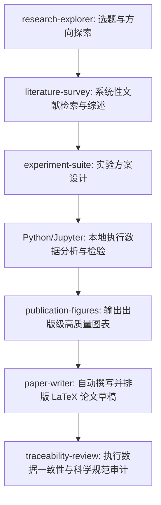

# AI-Scientist Playbook

[English](README.md) | [简体中文](README_zh.md) | [Français](README_fr.md) | [日本語](README_ja.md) | [한국어](README_ko.md) | [Español](README_es.md)

欢迎来到 **AI-Scientist Playbook**！这是一份精心整理的综合性指南，详细介绍了目前领先的开源 AI 科学家（AI-Scientist）工作台与本地优先的科研平台。其中包含资源汇总、详细的安装指南、常见问答（Q&A）以及高级优化技巧，旨在帮助科研人员利用 AI 提升科研效率。

---

## 🌟 AI-Scientist 资源汇总

| 项目名称 | 开发者 / 组织 | 官方网站 / 仓库链接 | 核心技术栈 | 开发状态 | 目标领域 |
| :--- | :--- | :--- | :--- | :--- | :--- |
| **Open Science Desktop** | [ai4s-research](https://github.com/ai4s-research) | [openedscience.com](https://openedscience.com) / [open-science](https://github.com/ai4s-research/open-science) | Tauri, Rust, JS/TS | Beta（活跃） | 通用科学 / 跨学科研究 |
| **OpenScience** | [synthetic-sciences](https://github.com/synthetic-sciences) | [openscience.sh](https://openscience.sh) / [openscience](https://github.com/synthetic-sciences/openscience) | Node.js, React, 浏览器 | 已发布（活跃） | 多学科（机器学习、生物、化学、物理） |
| **Open Science** | [aipoch](https://github.com/aipoch) | [aipoch.com](https://aipoch.com) / [open-science](https://github.com/aipoch/open-science) | Electron, React | Alpha（早期阶段） | 医学与生命科学 |
| **Runcell Science** | [runcell-ai](https://github.com/runcell-ai) | [runcell-science](https://github.com/runcell-ai/runcell-science) | 本地工作区, React | 活跃 | 多引擎（Claude Code/Codex 等） |
| **AutoResearchClaw** | [aiming-lab](https://github.com/aiming-lab) | [AutoResearchClaw](https://github.com/aiming-lab/AutoResearchClaw) | Python, 命令行工具 | 活跃 | 标准化评测 / 自动化执行 |
| **Dr. Claw** | [OpenLAIR](https://github.com/OpenLAIR) | [dr-claw](https://github.com/OpenLAIR/dr-claw) | 本地 IDE 智能体 | 活跃 | 代码密集型生信 / 医学研究 |
| **[The AI Scientist](https://github.com/SakanaAI/AI-Scientist)** | [Sakana AI](https://sakana.ai) | [AI-Scientist](https://github.com/SakanaAI/AI-Scientist) / [v2](https://github.com/SakanaAI/AI-Scientist-v2) | Python, PyTorch | 学术研究 | 机器学习 / AI 研究 |

---

## 🔍 核心项目详情

### 1. Open Science Desktop (ai4s-research)
基于 Tauri 开发的本地优先、模型无关的桌面客户端。它提供了一个快速、原生的桌面环境，用于管理科研 Agent，并支持通过标准的 Model Context Protocol (MCP) 服务连接外部资源。

*   **核心资源**：
    *   **GitHub 仓库**：[ai4s-research/open-science](https://github.com/ai4s-research/open-science)
    *   **官方网站**：[openedscience.com](https://openedscience.com)
    *   **科研技能库**：[ai4s-skills](https://github.com/ai4s-research/ai4s-skills)
*   **优势**：原生支持 MCP，体积轻量，开箱即用，覆盖科研全生命周期的完整技能包。
*   **局限性**：对于特定垂直领域的任务，较为依赖第三方技能包的导入。

### 2. OpenScience (synthetic-sciences)
这是一个交互式的网页端工作空间，将本地 Agent 运行时与浏览器用户界面结合在一起。该项目由 YC 孵化团队开发，开箱即用功能非常丰富。

*   **核心资源**：
    *   **GitHub 仓库**：[synthetic-sciences/openscience](https://github.com/synthetic-sciences/openscience)
    *   **官方网站**：[openscience.sh](https://openscience.sh)
    *   **NPM 安装包**：[@synsci/openscience](https://www.npmjs.com/package/@synsci/openscience)
*   **优势**：内置 290+ 个科研技能，原生对接 30 多个权威数据库（如 UniProt、PDB、arXiv、ChEMBL 等），端到端自动化能力极强。
*   **局限性**：没有独立的桌面客户端安装包，需要通过浏览器标签页进行交互。

### 3. Open Science (aipoch)
基于 Electron 开发的专业科研客户端，专门面向生物医学和生命科学领域。

*   **核心资源**：
    *   **GitHub 仓库**：[aipoch/open-science](https://github.com/aipoch/open-science)
    *   **官方网站**：[aipoch.com](https://aipoch.com)
    *   **医学技能库**：[medical-research-skills](https://github.com/aipoch/medical-research-skills)
*   **优势**：原生深度集成 PubMed、ClinVar 和 GEO 数据库；协同智能体架构完美适配医学工作流。
*   **局限性**：目前处于早期 alpha 阶段，部分核心功能仍处于积极开发或占位符状态。

### 4. Runcell Science (runcell-ai)
本地优先的可插拔 AI 科研工作区。其最大特点是不绑定单一 Agent 引擎，支持接入 Claude Code、Codex、OpenCode 等多种代码 Agent 作为执行核心。

*   **核心资源**：
    *   **GitHub 仓库**：[runcell-ai/runcell-science](https://github.com/runcell-ai/runcell-science)
*   **优势**：工作流界面设计与 Claude Science 高度一致；将会话、文件、连接器、代码 Diff 整合在统一环境中；原生支持 MCP。
*   **局限性**：偏向工作区配置，需要用户手动配置执行引擎。

### 5. AutoResearchClaw (aiming-lab)
配套了业内权威的 *ResearchClawBench* 科研能力评测基准的自动化科研框架。主打标准化科研任务的端到端自动化执行。

*   **核心资源**：
    *   **GitHub 仓库**：[aiming-lab/AutoResearchClaw](https://github.com/aiming-lab/AutoResearchClaw)
*   **优势**：具备明确的任务完成度量化评分，支持自定义任务模板，适合标准化实证研究与实验复现。
*   **局限性**：交互界面偏弱，更偏向命令行批量自动执行。

### 6. Dr. Claw (OpenLAIR)
由理海大学（Lehigh University）LAIR 实验室开发，将文献检索、代码执行、数据分析整合到统一 IDE 界面的集成式 Agent 平台。

*   **核心资源**：
    *   **GitHub 仓库**：[OpenLAIR/dr-claw](https://github.com/OpenLAIR/dr-claw)
*   **优势**：支持多种大模型/执行引擎切换，本地优先的数据隐私保护，内置人工校验节点以减少模型幻觉。适合代码密集型的生信分析任务。
*   **局限性**：界面偏向代码编辑器，综合工作台属性偏弱。

---

## 🗺️ 可部署科研 Agent 生态全景图

以下为科研人员和实验室可部署的主要科研智能体平台及框架列表：

| 智能体 / 工具包名称 | 开发方 | 发布时间 | 核心定位 | 部署方式 |
| :--- | :--- | :--- | :--- | :--- |
| **[Claude Science](https://www.anthropic.com/claude)** | Anthropic | 2026.6 | 通用科研 AI 工作台 | 本地 (macOS/Linux) + 云端 |
| **[Omic (Omic AI)](https://omic.ai/)** | Omic AI | 2025 | 生物超级智能 / 药物发现 | SaaS + 企业版私有化 |
| **[Biomni](https://biomni.stanford.edu)** | 斯坦福华人团队 | 2026.7 | 通用生物医学 Agent | 基于 Claude Platform，企业级 |
| **[ScienceOS](https://scienceos.ai/)** | 独立开发者 | 2025.8 | 文献研究 Agent | SaaS 云端 |
| **[The AI Scientist](https://github.com/SakanaAI/AI-Scientist)** | Sakana AI (日本) | 2024.8 | 全自动端到端科研发现 | 开源可自部署，Python (GitHub) |
| **[Co-Scientist](https://deepmind.google/discover/blog/introducing-co-scientist-using-ai-agents-for-scientific-hypothesis-generation/)** | Google DeepMind | 2026.5 | 多智能体假设生成 | Gemini for Science (需申请) |
| **[EvoScientist](https://github.com/EvoScientist/EvoScientist)** | 独立开发者 | 2026.3 | 自进化多智能体科研 | 开源 (Apache 2.0)，PyPI 安装 |
| **[Agent Laboratory](https://github.com/SamuelSchmidgall/AgentLaboratory)** | AMD + 约翰霍普金斯 | 2025.1 | 全流程自主科研框架 | 开源 (支持 CPU/GPU) |
| **[BioNeMo Agent Toolkit](https://github.com/NVIDIA-BioNeMo/bionemo-agent-toolkit)** | NVIDIA | 2026.6 | 生命科学智能体工具包 | NVIDIA NIM (云端或本地) |
| **[LUMI-lab](https://pharmacy.utoronto.ca/bowen-li)** | 多伦多大学 | 2025.2 | AI 自驱动实验室 (mRNA) | 实验室物理级实体部署 |
| **[Autoscience](https://www.autoscience.ai/)** | Autoscience | 2026.3 | 自主 AI 研究实验室 | 托管服务，面向企业 |
| **[OmicOS Science](https://github.com/omicverse)** | 国产团队 | 2026.7 | 组学分析 / 科研工作台 | App Store 上架 (本地 + 云端) |
| **[SciMaster](https://scimaster.bohrium.com/)** | 深势科技 + 上海交大 | 2025.7 | 通用科研智能体 | 玻尔平台 (SaaS + 私有部署) |
| **[MolClaw](https://github.com/InternScience/MolClaw)** | 上海 AI 实验室 + 北大 | 2026.5 | 新药筛选智能体 | 高校合作部署 |
| **[雅意・AI-Scientist](https://yayi.wenge.com)** | 中科闻歌 + 中科院 | 2025.7 | 科研文献助手 | SaaS 平台 |
| **[MoleculeOS (MOS)](https://mos.moleculemind.com/login)** | 分子之心 | 2026.7 | AI 生物研发操作系统 | 企业级平台 |
| **[MindSpore Science Agent](https://github.com/mindspore-ai/mindscience)**| 华为昇思 | 2026.4 | 科研智能体系统 | 开源，基于昇思框架 |
| **[ElementsClaw](https://arxiv.org/abs/2604.23758)** | 阿里达摩院 + 国科大 | 2026.7 | 超导材料发现 Agent | 开放预测数据库 / 智能体 |
| **[磐石・智能体工厂](https://scienceone.cn/)** | 中科院 | 2025.11 | 科研智能体生成平台 | 中科院磐石平台 |
| **["大圣" 科研智能体](https://www.sais.com.cn/)** | 上智院 + 复旦大学 | 2026.3 | 系统级高能动性科研 Agent | 星河启智平台 |
| **[BioMedAgent](https://github.com/BOBQWERA/BioMedAgent)** | 国内团队 | 2026.4 | 生物医学数据分析 Agent | 学术成果，可复现 |
| **[OmicsClaw](https://github.com/TianGzlab/OmicsClaw)** | 清华 AI4Life Lab | 2026.3 | 多组学 AI Agent | Docker 部署 (基于 OpenClaw) |

---

## 🧭 使用科研智能体的核心原则

若想在科研工作台中获得最佳体验，请务必遵循以下核心使用原则：

1.  **不要当成搜索引擎**：避免直接进行泛泛的问答（例如“帮我查查xx”）。工作台是用来执行复杂的本地工作流、运行代码和整理数据的。
2.  **拆解科研生命周期**：不要指望 Agent 能一步“写完一篇论文”。正确的做法是分步走：
    $$\text{选题探索} \rightarrow \text{文献检索} \rightarrow \text{综述矩阵} \rightarrow \text{实验设计} \rightarrow \text{代码执行} \rightarrow \text{图表生成} \rightarrow \text{论文写作} \rightarrow \text{诚信审计}$$
3.  **保存中间工件**：必须让 Agent 在每个阶段保存可追溯的中间产物（例如 `literature_matrix.csv`, `experiment_plan.md`, `results.json`, `figures/`, `paper.tex`）。
4.  **完整可追溯性 (Provenance)**：每项数据、图表和引用，都必须能回溯到对应的实验代码、输入文件或对话日志中。
5.  **仅作为初稿参考**：所有生成的产物均为初稿，发表或做出科研决策前必须由科研人员核验引用、数据、代码和结论。

---

## 💬 结构化提示词示例 (Claude Science 风格)

### 示例 1：做文献综述
*   ❌ **泛泛提问**：“帮我写一篇人工智能医疗综述。”
*   ✔️ **结构化提示词**：
    ```text
    请以“AI 辅助医学影像诊断在肺结节筛查中的应用”为主题，帮我完成系统性文献综述。
    要求：
    1. 拆解检索关键词，包括英文关键词、同义词和 MeSH 主题词；
    2. 使用 arXiv、PubMed、Semantic Scholar、Crossref 检索近五年的文献；
    3. 只保留真实可追溯文献，记录对应的 DOI、PMID 或 arXiv ID；
    4. 建立综述矩阵，字段包括：论文名称、年份、核心任务、数据集、方法、主要指标、主要结论和局限性；
    5. 总结 3 个当前的研究空白（Research Gaps），并推荐 3 个可写的论文方向；
    6. 严禁虚构文献，无法核实的引用单独列入“待核验文献”。
    ```
*   *对应技能*：`literature-survey`, `traceability-review`, `domain-check`。

### 示例 2：上传 CSV 做数据分析
*   ❌ **泛泛提问**：“帮我分析这个实验数据。”
*   ✔️ **结构化提示词**：
    ```text
    请分析 workspace/data/experiment.csv 数据文件。
    任务：
    1. 先检查各字段含义，处理缺失值和异常值；
    2. 生成描述性统计数据；
    3. 根据数据分布类型，选择合适的统计学检验方法进行显著性分析；
    4. 输出至少 3 张适合论文发表使用的图表，并保存到 figures/ 目录中；
    5. 将所有详细的统计分析结果保存到 results/statistics.md；
    6. 撰写一段学术手稿的 "Results" 小节，必须明确区分“测量事实”与“推论解释”。
    ```
*   *对应技能*：`stats-integrity`, `publication-figures`, `experiment-suite`。

### 示例 3：复现一篇论文实验
*   ✔️ **结构化提示词**：
    ```text
    请帮我复现这篇论文的核心实验。
    输入材料：
    - paper.pdf (已放入工作区)
    - 原始代码仓库：见项目 README 链接
    - 数据集说明文件：data/README.md
    要求：
    1. 先阅读论文，提取核心实验目标和评价指标；
    2. 检查现有的代码是否能顺利运行；
    3. 生成项目的环境依赖列表 (requirements.txt / environment.yml)；
    4. 尝试运行最小可复现实验 (MRE)；
    5. 将每一步运行的命令、遇到的错误以及修复方式详细记录在 runs/reproduction_log.md 中；
    6. 输出复现结果的对照表格，对比复现结果与论文原图表。
    ```

### 示例 4：撰写手稿初稿
*   ✔️ **结构化提示词**：
    ```text
    请基于工作区内的以下科研材料，撰写一篇论文初稿：
    参考材料：
    - literature_survey.md
    - results/statistics.md
    - figures/ (引用已生成的图表路径)
    - experiment_log.md
    要求：
    1. 使用标准的学术论文结构：Abstract, Introduction, Related Work, Method, Experiment, Results, Discussion, Limitations, Conclusion;
    2. 正文的所有引用必须严格匹配 bibliography.bib 中的文献条目；
    3. 生成 LaTeX 源码；
    4. 写作完成后，运行 traceability-review 和 stats-integrity 检查以核验数据一致性。
    ```
*   *对应技能*：`paper-writer`, `publication-figures`, `traceability-review`。

### 示例 5：审查 AI 生成的论文
*   ✔️ **结构化提示词**：
    ```text
    请审查 paper.pdf 的科研完整性与学术规范。
    重点检查：
    1. 正文引用的文献是否真实存在，DOI/PMID 是否能核实；
    2. 文中的数据和结果是否能追溯到 results/statistics.md；
    3. 检查是否存在将“模拟/预测结果 (simulated/predicted)”虚构成“实际测量数据 (measured)”的问题；
    4. 输出 audit_report.md，按严重程度分级 (Major, Minor, Informational) 列出问题。
    ```
*   *对应技能*：`integrity-auditor`。

---

## 🛠️ 扩展技能包与 MCP 兼容

### 1. 通用与跨学科技能包
*   **K-Dense Scientific Agent Skills**：包含 138+ 个开箱即用的科研技能，覆盖生物信息、计算化学、临床研究、地学、统计计量和金融经济等。对接 ClinVar、ChEMBL、COSMIC、FRED 等专业数据库。
*   **scdenney/open-science-skills**：包含 23 个社会科学方向的专项技能，支持文本计算、问卷效度检验、伦理审查等。

### 2. 垂直领域专项技能
*   **生物信息学 (`Genomic Analysis`)**：序列比对、基因差异表达分析、变异位点注释，支持 FASTQ/VCF 文件，对接 NCBI/Ensembl。
*   **化学与药物研发 (`Cheminformatics Toolkit`)**：基于 RDKit 的分子结构处理、相似度计算、ADMET 预测、化合物虚拟筛选。
*   **临床医学 (`Clinical Research`)**：临床试验检索、变异致病性解读、循证医学证据分级，对接 ClinicalTrials 和 ClinVar 数据库。
*   **经济与金融 (`Economic Data Analysis`)**：经济时间序列建模、企业财报数据提取、计量分析，对接 FRED、SEC EDGAR。
*   **地学与环境 (`Geospatial Analysis`)**：空间插值、遥感影像分析、栅格与矢量地理数据处理，基于 GeoPandas 和 GDAL。

### 3. 工作流效率补充
*   **文献同步**：原生连接 Zotero/Mendeley 个人文献库，读取收藏并同步引用标签。
*   **出版级制图**：基于 Matplotlib/Plotly 封装，预设期刊规范配色、多子图排版与矢量图导出。
*   **可复现环境**：自动封装实验代码和依赖，一键生成 Conda/Docker 可复现环境配置文件。

### 4. MCP (Model Context Protocol) 连接器
*   **mcp.science**：汇集了 Materials Project 数据库、PubMed Central 全文检索、安全 Python 沙箱执行等专属 MCP 服务。
*   **本地工具连接器**：Jupyter MCP、Excel/CSV 读写 MCP、本地文件系统 MCP。
*   **GitHub MCP**：直连 GitHub 仓库，被 Agent 用于代码检索、版本 Diff 对照和 Issue 管理。

---

## 📂 模板与配置示例

为了帮助您快速上手，本仓库提供了开箱即用的科研模板与配置示例：

- **[文献综述矩阵模板 (CSV)](templates/literature_matrix_template.csv)**：一个结构化的 CSV 模板，用于整理文献检索参数、研究结果、指标和 DOI。
- **[实验方案设计模板 (Markdown)](templates/experiment_plan_template.md)**：一个标准化的 Markdown 模板，用于记录假设定义、数据集描述、基准模型、运行历史以及数据审计核对表。
- **[MCP (Model Context Protocol) 配置文件示例 (JSON)](examples/mcp_config_example.json)**：一个 JSON 配置文件示例，展示如何配置 PubMed Central、Materials Project、SQLite、本地文件系统及 GitHub MCP 服务器。

---

## ❓ 常见问答与故障排除

### Q1: 为什么在 Windows 上工作台提示 "Python not found"？
通常是因为 Python 未安装或没有加入系统 `PATH` 环境变量。Windows 默认的 `python` 命令可能指向微软商店的快捷方式。请重新下载 Python 安装包，并确保在安装时勾选了 "Add Python to PATH"。正确安装后的路径通常为：
`C:\Users\<您的用户名>\AppData\Local\Programs\Python\Python312\python.exe`

### Q2: 提示 Jupyter 命令找不到该如何解决？
如果 `python -m jupyter --version` 可以运行，但 `jupyter --version` 报错，说明 Python 的 Scripts 目录没有加入 PATH。请将 `C:\Users\<您的用户名>\AppData\Local\Programs\Python\Python312\Scripts\` 添加到用户环境变量的 `PATH` 中，然后重启客户端。

### Q3: 安装了 R 语言但工作台提示找不到？
R 语言的 `Rscript.exe` 目录需要手动加入系统 PATH。路径一般位于：
`C:\Program Files\R\R-4.x.x\bin\x64`（将此路径加到 PATH 中并重启客户端）。

### Q4: Windows 启动时 SmartScreen 拦截并提示不安全？
由于开源客户端在本地构建时未进行商业代码签名，Windows Defender 会发出警告。点击 **更多信息 (More info)** 并选择 **仍要运行 (Run anyway)** 即可。您可以审查代码仓库源码以确认安全性。

### Q5: 这些 Agent 可以联网查阅最新文献吗？
可以，但强烈建议通过专门的 MCP 连接器进行。使用 arXiv、PubMed、Crossref、Semantic Scholar 等 MCP 连接器可以使大模型直接接收结构化数据，避免网页爬取时的格式混乱与信息缺失。

### Q6: 导入大量第三方技能包安全吗？
技能包拥有执行终端命令、安装依赖和读写本地文件的权限。请在导入未经验证的第三方技能包前，仔细审查其源代码，避免安全隐患。

### Q7: 这类科研工作台与 Cursor 或 Claude 网页端有什么区别？
通用客户端仅能进行基础的对话或代码编写，不具备科研上下文认知。专属科研工作台原生集成了本地工作区文件视图、本地数据缓存查看器、自动文献库映射、版本 Diff 核验，并配置了专门为科学研究全流程（选题-实验-写作-审计）定制的子智能体协同网络。

### Q8: 使用时需要一条条输入指令吗？
不需要。只需在工作区输入一段结构化的完整 Prompt（包含研究主题、数据说明、参考指标规范等），Agent 就会自动跑完整个流程，生成日志并保存图表。

### Q9: 参考文献的插入是自动完成的吗？
是的。Agent 会在文献综述阶段自动生成标准的 BibTeX 文献数据库（`.bib` 文件），并在论文撰写时于正文对应位置标注引用标记，同时在文末同步生成排版规范的参考文献列表。

---

## 🚀 推荐环境配置与科研工作流

为了构建稳定且功能完整的科研环境，我们推荐以下配置：

### 1. 软件栈准备
- **科学工作台**：[Open Science Desktop](https://github.com/ai4s-research/open-science)
- **底层依赖**：Python (3.12+), Node.js (LTS), R 语言
- **必装工具**：JupyterLab, Git, Rscript
- **大模型 API**：推荐采用 **Gemini 2.5 Flash**（超大上下文，适合吞吐文献）或 **GPT-4o mini** 与 **Claude 3.5 Haiku**（高性价比，适合子 Agent 任务调度与路由）作为基础调度模型，撰写阶段切换至 **Claude 3.5 Sonnet**。

### 2. 标准科研流水线


---

## 🤝 贡献与许可
欢迎为本指南做出贡献！您可以随时提出 Issue 或提交 Pull Request，补充新的资源、技巧或翻译版本，请参考我们的 **[贡献指南 (CONTRIBUTING.md)](CONTRIBUTING.md)**。

本项目采用 **[MIT 许可证 (LICENSE)](LICENSE)** 开源。
